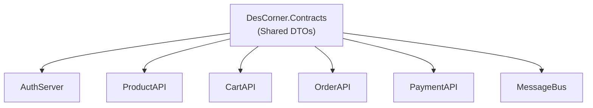

# DesCorner.Contracts

**Shared DTO library containing contract files across 9 subdomains — the single source of truth for inter-service communication in the DesiCorner platform.**

[]()
[]()

---

## Role in the System

DesCorner.Contracts is a **pure .NET 8.0 class library** with zero external NuGet dependencies. It defines all Data Transfer Objects (DTOs), request/response models, and event contracts shared across microservices. Every backend service references this library to ensure type-safe serialization across service boundaries.

This library contains **no business logic, no database models, and no infrastructure concerns** — only the shapes of data that flow between services via HTTP (and the message bus when activated).



> 📖 For the overall system architecture, see the [root README](../README.md).

---

## Technology

| Technology | Version | Note |
|-----------|---------|------|
| .NET | 8.0 | Pure class library — no NuGet dependencies |

**Zero external dependencies by design** — contracts should never pull in framework-specific packages that would create dependency conflicts in consuming services.

---

## Contract Inventory

| Subdomain | Key DTOs |
|-----------|----------|
| **Admin** | `DashboardStatsDto` |
| **Auth** | `LoginRequestDto`, `RegisterRequestDto`, `UserDto`, `SendOtpRequestDto`, `VerifyOtpRequestDto`, `ChangePasswordDto`, `AddAddressDto`, `AdminUserDto` |
| **Cart** | `CartDto`, `AddToCartDto`, `ApplyCouponDto`, `UpdateCartItemDto` |
| **Common** | `ResponseDto`, `PaginatedResponse` |
| **Coupons** | `CouponDto`, `AdminCouponDto`, `ValidateCouponRequestDto`, `ValidateCouponResponseDto` |
| **Orders** | `OrderDto`, `CreateOrderDto`, `OrderSummaryDto`, `UpdateOrderStatus`, `OrderType` (enum), `AdminOrderDto` |
| **Payment** | `PaymentIntentRequestDto`, `PaymentIntentResponse`, `ConfirmPaymentDto`, `PaymentWebhookDto`, `VerifyPaymentRequest`, `VerifyPaymentResponse` |
| **Products** | `ProductDto`, `CategoryDto`, `CreateProductDto`, `UpdateProductDto`, `ProductStatsDto` |
| **Reviews** | `ReviewDto`, `CreateReviewDto`, `ReviewSummaryDto`, `ReviewVoteDto`, `UpdateReviewDto` |

---

## Design Conventions

- All DTOs are **POCOs with public getters** — no behavior, no dependencies
- Request DTOs use data annotation attributes (`[Required]`, `[StringLength]`, etc.) for validation
- Response DTOs are **denormalized** where needed — include all fields the frontend requires to avoid extra API calls
- `ResponseDto` wraps all API responses with a consistent shape: `IsSuccess`, `Message`, and `Result` properties
- Naming convention: `{Action}{Domain}Dto` (e.g., `CreateProductDto`, `ApplyCouponDto`)

---

## Referenced By

| Project | Subdomains Used |
|---------|----------------|
| [AuthServer](../DesiCorner.AuthServer/) | Auth, Common |
| [ProductAPI](../DesiCorner.Services.ProductAPI/) | Products, Reviews, Common |
| [CartAPI](../DesiCorner.Services.CartAPI/) | Cart, Coupons, Common |
| [OrderAPI](../DesiCorner.Services.OrderAPI/) | Orders, Cart, Common |
| [PaymentAPI](../DesiCorner.Services.PaymentAPI/) | Payment, Common |
| [MessageBus](../DesiCorner.MessageBus/) | Orders, Payment (event payloads — scaffolded, not yet active) |

---

## Folder Structure

```
DesCorner.Contracts/
├── Admin/
│   └── DashboardStatsDto.cs
├── Auth/
│   ├── AddAddressDto.cs
│   ├── AdminUserDto.cs
│   ├── ChangePasswordDto.cs
│   ├── LoginRequestDto.cs
│   ├── RegisterRequestDto.cs
│   ├── SendOtpRequestDto.cs
│   ├── UserDto.cs
│   └── VerifyOtpRequestDto.cs
├── Cart/
│   ├── AddToCartDto.cs
│   ├── ApplyCouponDto.cs
│   ├── CartDto.cs
│   └── UpdateCartItemDto.cs
├── Common/
│   ├── PaginatedResponse.cs
│   └── ResponseDto.cs
├── Coupons/
│   ├── AdminCouponDto.cs
│   ├── CouponDto.cs
│   ├── ValidateCouponRequestDto.cs
│   └── ValidateCouponResponseDto.cs
├── Orders/
│   ├── AdminOrderDto.cs
│   ├── CreateOrderDto.cs
│   ├── OrderDto.cs
│   ├── OrderSummaryDto.cs
│   ├── OrderType.cs
│   └── UpdateOrderStatus.cs
├── Payment/
│   ├── ConfirmPaymentDto.cs
│   ├── PaymentIntentRequestDto.cs
│   ├── PaymentIntentResponse.cs
│   ├── PaymentWebhookDto.cs
│   ├── VerifyPaymentRequest.cs
│   └── VerifyPaymentResponse.cs
├── Products/
│   ├── CategoryDto.cs
│   ├── CreateProductDto.cs
│   ├── ProductDto.cs
│   ├── ProductStatsDto.cs
│   └── UpdateProductDto.cs
└── Reviews/
    ├── CreateReviewDto.cs
    ├── ReviewDto.cs
    ├── ReviewSummaryDto.cs
    ├── ReviewVoteDto.cs
    └── UpdateReviewDto.cs
```
