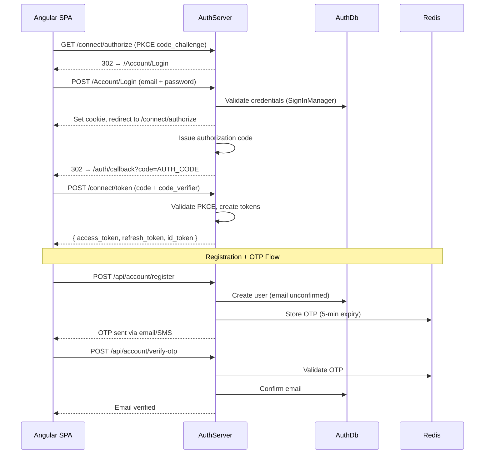

# DesiCorner.AuthServer

**OAuth 2.0 / OpenID Connect identity server -- handles user registration, authentication, JWT token issuance, profile management, OTP verification, and role-based access control.**

[]()
[]()
[]()

---

## Role in the System

The AuthServer is the **centralized identity provider** for the entire DesiCorner platform. It issues JWT access tokens that all other microservices validate. The Angular frontend authenticates via OAuth 2.0 Authorization Code + PKCE flow, receiving JWTs that are forwarded through the YARP gateway to downstream services.



**Communicates with:**
- **Gateway** ← validates JWTs issued by this server (via JWKS auto-discovery at `/.well-known/jwks`)
- **All downstream services** ← accept JWTs issued by this server
- **Redis** → OTP storage with expiry, token blacklisting, session caching
- **SQL Server (AuthDb)** → User accounts, roles, delivery addresses, data protection keys, OpenIddict tables
- **External services** → SMTP (MailKit) for emails, Twilio for SMS/OTP

> 📖 For the overall system architecture, see the [root README](../README.md).

---

## Technology & Packages

| Package | Version | Purpose |
|---------|---------|---------|
| `OpenIddict.AspNetCore` | 7.1.0 | OAuth 2.0 / OIDC server -- token issuance, authorization flows, PKCE |
| `OpenIddict.EntityFrameworkCore` | 7.1.0 | Persists OAuth clients, tokens, scopes in SQL Server |
| `Microsoft.AspNetCore.Identity.EntityFrameworkCore` | 8.0.21 | User management (registration, login, roles, claims) backed by EF Core |
| `Microsoft.AspNetCore.Authentication.JwtBearer` | 8.0.21 | JWT Bearer authentication for API endpoints |
| `Microsoft.AspNetCore.DataProtection.EntityFrameworkCore` | 8.0.21 | Persists data protection keys in DB for multi-instance deployments |
| `Microsoft.EntityFrameworkCore.SqlServer` | 8.0.21 | EF Core SQL Server provider for AuthDb |
| `Microsoft.EntityFrameworkCore.Tools` | 8.0.21 | Migration CLI tooling (`add-migration`, `update-database`) |
| `Microsoft.Extensions.Caching.StackExchangeRedis` | 8.0.21 | Distributed caching for OTP, sessions, rate limiting |
| `StackExchange.Redis` | 2.9.32 | Direct Redis client for OTP storage, rate limiting, and caching |
| `MailKit` | 4.14.1 | SMTP email for verification and password reset |
| `Twilio` | 7.13.5 | SMS/OTP verification via Twilio API |
| `Swashbuckle.AspNetCore` | 9.0.6 | Swagger/OpenAPI documentation |

**Project References:** `DesCorner.Contracts`

---

## API Endpoints

### OpenID Connect / OAuth 2.0 (AuthorizationController)

| Method | Endpoint | Auth | Description |
|--------|----------|------|-------------|
| `GET/POST` | `/connect/authorize` | Cookie | OAuth 2.0 authorization endpoint -- initiates authorization code flow |
| `POST` | `/connect/token` | Anonymous | Token exchange -- authorization code, password grant, or refresh token |
| `GET` | `/connect/userinfo` | Bearer Token | Returns authenticated user's profile claims |
| `POST` | `/connect/introspect` | Client Credentials | Token introspection for Gateway validation |
| `GET` | `/.well-known/openid-configuration` | Anonymous | OpenID Connect discovery document |
| `GET` | `/.well-known/jwks` | Anonymous | JSON Web Key Set for signature verification |

### Account Management (AccountController -- `/api/account`)

| Method | Endpoint | Auth | Description |
|--------|----------|------|-------------|
| `POST` | `/api/account/register` | Anonymous | Register a new user account |
| `POST` | `/api/account/login` | Anonymous | Login with email/password, returns JWT |
| `GET` | `/api/account/check-auth` | Anonymous | Check if session is authenticated |
| `POST` | `/api/account/send-otp` | Anonymous | Send OTP via email or SMS |
| `POST` | `/api/account/verify-otp` | Anonymous | Verify OTP code |
| `GET` | `/api/account/user-lookup?email=&phone=` | Anonymous | Lookup user for guest checkout linking |
| `POST` | `/api/account/logout` | Bearer Token | Logout and clear session |
| `GET` | `/api/account/profile` | Bearer Token | Get user profile with addresses |
| `POST` | `/api/account/addresses` | Bearer Token | Add delivery address |
| `POST` | `/api/account/change-password` | Bearer Token | Change password |

### Admin User Management (AdminController -- `/api/admin`)

| Method | Endpoint | Auth | Description |
|--------|----------|------|-------------|
| `GET` | `/api/admin/users` | Admin | List users with filtering, sorting, pagination |
| `GET` | `/api/admin/users/{userId}` | Admin | Get user details by ID |
| `POST` | `/api/admin/users/role` | Admin | Add or remove role from user |
| `POST` | `/api/admin/users/lock` | Admin | Lock or unlock user account |
| `GET` | `/api/admin/users/stats` | Admin | User statistics (total, active, new, locked) |
| `GET` | `/api/admin/users/recent?count=5` | Admin | Recent user registrations |
| `GET` | `/api/admin/roles` | Admin | List all available roles |

---

## Database Schema (AuthDb)

**EF Core code-first** -- run `dotnet ef database update --project DesiCorner.AuthServer` to create.

### Key Entities

- **ApplicationUser** -- Extends ASP.NET Identity with: `DietaryPreference`, `RewardPoints`, `PendingOtp`, `OtpExpiry`, `OtpAttempts`, `CreatedAt`, `LastLoginAt`
- **ApplicationRole** -- Custom role entity with `Description`, `CreatedAt`. Seeded roles: Admin, Customer
- **DeliveryAddress** -- User's saved addresses: `Label`, `AddressLine1/2`, `City`, `State`, `ZipCode`, `IsDefault` (1:N relationship with ApplicationUser)
- **OpenIddict tables** -- Applications, Authorizations, Tokens, Scopes (auto-managed by OpenIddict EF Core)
- **DataProtectionKeys** -- Persisted data protection keys for token encryption across app restarts

---

## Configuration

| Setting | Description | Example |
|---------|-------------|---------|
| `ConnectionStrings:DefaultConnection` | SQL Server for AuthDb | `Server=.;Database=DesiCornerAuth;Trusted_Connection=True;TrustServerCertificate=True;` |
| `ConnectionStrings:Redis` | Redis connection | `localhost:6379` |
| `JwtSettings:Secret` | JWT signing key (min 32 chars) | `your-secret-key-min-32-characters` |
| `JwtSettings:Issuer` | Token issuer URL | `https://localhost:7001` |
| `JwtSettings:Audience` | Token audience | `desicorner-api` |
| `JwtSettings:ExpiryMinutes` | Token lifetime | `60` |
| `SmtpSettings:Host` | SMTP server | `smtp.gmail.com` |
| `SmtpSettings:Port` | SMTP port | `587` |
| `SmtpSettings:Username` | SMTP username | `your_email@gmail.com` |
| `SmtpSettings:Password` | SMTP app password | *(use environment variable)* |
| `Twilio:AccountSid` | Twilio account SID | *(use environment variable)* |
| `Twilio:AuthToken` | Twilio auth token | *(use environment variable)* |
| `Twilio:PhoneNumber` | Twilio sender number | `+1234567890` |

> ⚠️ **Never commit real secrets.** Use `dotnet user-secrets` or environment variables for Stripe keys, SMTP passwords, and Twilio credentials.

---

## Running Independently

```bash
# Ensure Redis is running
redis-cli ping   # Expected: PONG

# Run database migrations (creates AuthDb automatically)
dotnet ef database update --project DesiCorner.AuthServer

# Start the service
dotnet run --project DesiCorner.AuthServer
# Running on https://localhost:7001

# Verify: Open Swagger UI
# https://localhost:7001/swagger

# Verify: OpenID discovery
# https://localhost:7001/.well-known/openid-configuration
```

**Dependencies:** Requires Redis (for OTP and caching) and SQL Server (for user data). No other DesiCorner services required -- AuthServer is independently runnable.

---

## OAuth Login UI (Razor Pages)

The AuthServer hosts its own login/logout pages using Razor Pages. In the OAuth 2.0 PKCE flow, the Angular SPA redirects to the AuthServer's login page rather than collecting credentials directly -- credentials never pass through the SPA.

| Page | Path | Purpose |
|------|------|---------|
| Login | `/Account/Login` | DesiCorner-branded login form (email + password). Sets auth cookie on success, redirects back to `/connect/authorize` to issue the auth code. |
| Logout | `/Account/Logout` | Clears the `.DesiCorner.Auth` cookie and redirects to the Angular app's `postLogoutRedirectUri`. |

**Security features:**
- Unverified email → shows error with link to Angular's OTP verification page
- Account lockout after 5 failed attempts (15-minute lockout)
- ReturnUrl preserved through login → authorize → callback chain
- Logout endpoint validates `post_logout_redirect_uri` against allowed origins

---

## Key Components

| Component | File | Purpose |
|-----------|------|---------|
| AccountController | `Controllers/AccountController.cs` | User registration, login, profile, OTP, addresses |
| AuthorizationController | `Controllers/AuthorizationController.cs` | OpenIddict OAuth 2.0 authorization + token endpoints |
| AdminController | `Controllers/AdminController.cs` | User/role management (admin only) |
| LoginModel | `Pages/Account/Login.cshtml.cs` | Razor Page for OAuth login (PKCE flow) |
| LogoutModel | `Pages/Account/Logout.cshtml.cs` | Razor Page for server-side logout (clears auth cookie) |
| TokenService | `Services/TokenService.cs` | JWT token generation with claims |
| EmailService | `Services/EmailService.cs` | SMTP email via MailKit |
| OtpService | `Services/OtpService.cs` | Redis-backed OTP with expiry |
| MockOtpService | `Services/MockOtpService.cs` | Development mock for OTP |
| ApplicationUser | `Identity/ApplicationUser.cs` | Extended Identity user entity |
| DeliveryAddress | `Identity/DeliveryAddress.cs` | User delivery address entity |
| Seed | `Infrastructure/Seed.cs` | OpenIddict client application seeding |
| DbInitializer | `Data/DbInitializer.cs` | Role seeding (Admin, Customer) |
