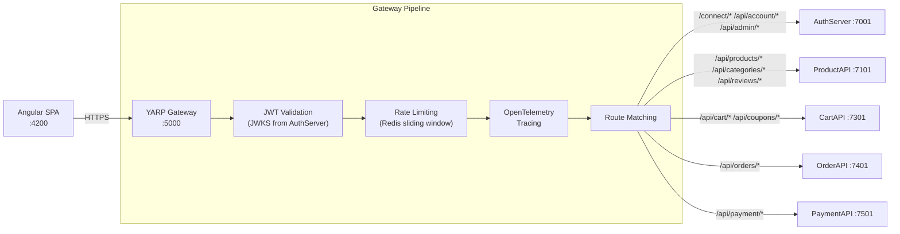

# DesiCorner.Gateway

**YARP reverse proxy API gateway with JWT validation, Redis-based rate limiting, OpenTelemetry distributed tracing, and intelligent request routing to 5 backend microservices.**

[]()
[]()
[]()

---

## Role in the System

The Gateway is the **single entry point** for all client requests. The Angular frontend sends every API call to `https://localhost:5000`, and the Gateway routes it to the appropriate backend service. Before routing, it validates JWT tokens, applies rate limiting, and instruments requests with OpenTelemetry distributed tracing.



**No database** -- the Gateway is stateless. Uses Redis only for rate limiting and response caching.

> 📖 For the overall system architecture, see the [root README](../README.md).

---

## Technology & Packages

| Package | Version | Purpose |
|---------|---------|---------|
| `Yarp.ReverseProxy` | 2.3.0 | Microsoft's high-performance reverse proxy -- routing, load balancing, health checks, transforms |
| `Microsoft.Extensions.Caching.StackExchangeRedis` | 9.0.10 | Response caching in Redis to reduce backend load |
| `Microsoft.IdentityModel.Tokens` | 8.14.0 | Token validation primitives (signing keys, token parameters) |
| `System.IdentityModel.Tokens.Jwt` | 8.14.0 | JWT token reading and validation |
| `StackExchange.Redis` | 2.9.32 | Redis connectivity for rate limiting and caching |
| `OpenTelemetry.Exporter.Console` | 1.13.1 | Telemetry export to console (local debugging) |
| `OpenTelemetry.Extensions.Hosting` | 1.13.1 | OpenTelemetry integration with ASP.NET Core hosting |
| `OpenTelemetry.Instrumentation.AspNetCore` | 1.13.0 | Auto-instruments incoming HTTP requests with tracing spans |
| `OpenTelemetry.Instrumentation.Http` | 1.13.0 | Auto-instruments outgoing HTTP calls to downstream services |
| `OpenTelemetry.Instrumentation.Runtime` | 1.13.0 | .NET runtime metrics (GC, thread pool, allocations) |

**Project References:** None (standalone -- routes to services via YARP configuration)

---

## Route Map (YARP Configuration)

| Gateway Route | Target Service | Destination | Description |
|--------------|---------------|-------------|-------------|
| `/connect/authorize` | auth | AuthServer :7001 | OAuth 2.0 authorization |
| `/connect/token` | auth | AuthServer :7001 | Token exchange |
| `/connect/introspect` | auth | AuthServer :7001 | Token introspection |
| `/connect/userinfo` | auth | AuthServer :7001 | User info endpoint |
| `/.well-known/{**remainder}` | auth | AuthServer :7001 | OIDC discovery & JWKS |
| `/api/account/{**remainder}` | auth | AuthServer :7001 | Account management |
| `/api/admin/{**catch-all}` | auth | AuthServer :7001 | Admin user management |
| `/api/products/{**remainder}` | product | ProductAPI :7101 | Product catalog |
| `/api/products/admin/{**catch-all}` | product | ProductAPI :7101 | Product admin stats |
| `/api/categories/{**remainder}` | product | ProductAPI :7101 | Category management |
| `/api/reviews/{**remainder}` | product | ProductAPI :7101 | Product reviews |
| `/api/cart/{**remainder}` | cart | CartAPI :7301 | Shopping cart |
| `/api/coupons/{**catch-all}` | cart | CartAPI :7301 | Coupon management |
| `/api/orders/{**remainder}` | order | OrderAPI :7401 | Order management |
| `/api/payment/{**remainder}` | payment | PaymentAPI :7501 | Payment processing |

### Rate Limiting

| Scope | Window | Max Requests |
|-------|--------|-------------|
| Auth Endpoints | 60 seconds | 60 requests |
| API Endpoints | 60 seconds | 100 requests |

---

## Gateway-Only Endpoints

| Method | Endpoint | Description |
|--------|----------|-------------|
| `GET` | `/health/ready` | Health check / readiness probe |

---

## Key Components

| Component | File | Purpose |
|-----------|------|---------|
| TokenAuthenticator | `Auth/TokenAuthenticator.cs` | JWT validation with multiple strategies (JWKS auto-fetch + manual) |
| JwksProvider | `Auth/JwksProvider.cs` | Auto-fetches signing keys from AuthServer's `/.well-known/jwks` endpoint |
| IntrospectionClient | `Auth/IntrospectionClient.cs` | Token introspection for opaque token validation |
| RedisRateLimiter | `Auth/RedisRateLimiter.cs` | Sliding window rate limiting via Redis |
| ScopeAuthorizationHandler | `Policies/ScopeAuthorizationHandler.cs` | Custom OAuth scope-based authorization policies |
| ForwardingTransforms | `Transforms/ForwardingTransforms.cs` | Forwards user identity headers (`X-User-Id`, `X-User-Email`) to downstream services |

---

## Configuration

| Setting | Description | Example |
|---------|-------------|---------|
| `ReverseProxy:Clusters:*:Destinations` | Backend service URLs | Defined per cluster in `appsettings.json` |
| `ConnectionStrings:Redis` | Redis for rate limiting | `localhost:6379` |
| `JwtSettings:Authority` | AuthServer URL for JWKS discovery | `https://localhost:7001` |
| `JwtSettings:Audience` | Expected JWT audience | `desicorner-api` |
| `CorsPolicy` | Allowed origins | `http://localhost:4200` |

---

## Running Independently

```bash
# Ensure Redis is running
redis-cli ping

# Start the Gateway
dotnet run --project DesiCorner.Gateway
# Running on https://localhost:5000

# Verify health check
curl https://localhost:5000/health/ready
```

**Dependencies:** Requires Redis (for rate limiting). Backend services should be running for routes to function, but the Gateway itself starts without them.
