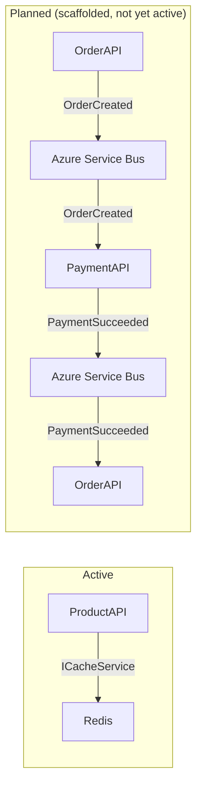
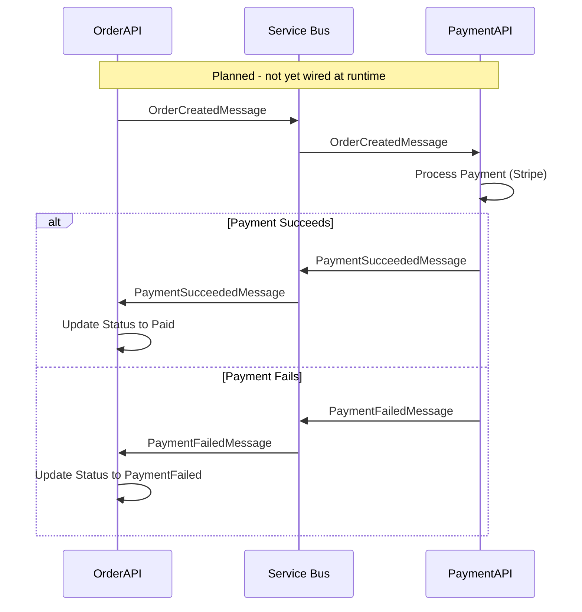

# DesiCorner.MessageBus

**Shared library providing a Redis caching abstraction (active) and Azure Service Bus publish/subscribe scaffolding (not yet active at runtime).**

[]()
[-0078D4?style=flat-square)]()

---

## Role in the System

DesiCorner.MessageBus serves two purposes:

1. **Redis caching abstraction (Active)** — `ICacheService` / `CacheService` is used by ProductAPI to cache product and category data in Redis.
2. **Azure Service Bus messaging (Scaffolded)** — Publisher, consumer, and four event message types are fully implemented but **not yet wired into any service at runtime**. The Service Bus connection string is empty in configuration, and no service currently publishes or consumes events. All inter-service communication today is synchronous HTTP.



> 📖 For the overall system architecture, see the [root README](../README.md).

---

## Technology & Packages

| Package | Version | Purpose |
|---------|---------|---------|
| `Azure.Messaging.ServiceBus` | 7.20.1 | Enterprise message broker — scaffolded but not yet active at runtime |
| `StackExchange.Redis` | 2.9.32 | Redis client used for distributed caching (`ICacheService`) |
| `System.Text.Json` | 9.0.10 | High-performance JSON serialization for message payloads |
| `Microsoft.Extensions.Configuration.Abstractions` | 9.0.10 | Configuration abstraction (connection strings, queue names) |
| `Microsoft.Extensions.DependencyInjection.Abstractions` | 9.0.10 | DI registration for consuming services |
| `Microsoft.Extensions.Logging.Abstractions` | 9.0.10 | Logging abstraction for publish/consume operations |

---

## Event Catalog (Scaffolded — Not Yet Active)

> **Note:** The four event message types below are fully implemented as C# classes but are **not published or consumed by any service at runtime**. They represent the planned async messaging flow.

| Event | Planned Publisher | Planned Consumer(s) | Purpose |
|-------|-------------------|---------------------|---------|
| `OrderCreatedMessage` | OrderAPI | PaymentAPI | Will trigger payment processing for new orders |
| `OrderConfirmedMessage` | OrderAPI | *(future consumers)* | Will notify that order processing is complete |
| `PaymentSucceededMessage` | PaymentAPI | OrderAPI | Will update order status to "Paid" |
| `PaymentFailedMessage` | PaymentAPI | OrderAPI | Will update order status to "PaymentFailed" |

### Planned Event Flow (not yet active)



---

## Key Components

| Component | Interface | Implementation | Purpose |
|-----------|-----------|---------------|---------|
| Cache | `ICacheService` | `CacheService` | **Active** — Redis caching abstraction with typed get/set/delete |
| Publisher | `IServiceBusPublisher` | `ServiceBusPublisher` | *Scaffolded* — Publishes events to Azure Service Bus queues/topics |
| Consumer | `IServiceBusConsumer` | `ServiceBusConsumer` | *Scaffolded* — Subscribes to and processes events |
| Base Event | `BaseMessage` | *(abstract)* | *Scaffolded* — Base class for all event messages (Id, CreatedAt) |
| Registration | — | `ServiceCollectionExtensions` | DI helper: `services.AddMessageBus(configuration)` |

---

## Usage

```csharp
// In a consuming service's Program.cs
builder.Services.AddMessageBus(builder.Configuration);

// ── Active: caching ──
var cache = serviceProvider.GetRequiredService<ICacheService>();
await cache.SetAsync("products:all", products, TimeSpan.FromMinutes(10));
var cached = await cache.GetAsync<List<ProductDto>>("products:all");

// ── Scaffolded (not yet called at runtime): publishing ──
var publisher = serviceProvider.GetRequiredService<IServiceBusPublisher>();
await publisher.PublishAsync(new OrderCreatedMessage { OrderId = orderId, Amount = total });

// ── Scaffolded (not yet called at runtime): consuming ──
var consumer = serviceProvider.GetRequiredService<IServiceBusConsumer>();
consumer.Subscribe<PaymentSucceededMessage>(async message => {
    // Update order status
});
```

---

## Referenced By

| Project | Usage |
|---------|-------|
| [ProductAPI](../DesiCorner.Services.ProductAPI/) | `ICacheService` for product/category caching **(active)** |
| [CartAPI](../DesiCorner.Services.CartAPI/) | Project reference present (caching available) |
| [OrderAPI](../DesiCorner.Services.OrderAPI/) | Project reference present (event publishing scaffolded, not yet active) |
| [PaymentAPI](../DesiCorner.Services.PaymentAPI/) | Project reference present (event consumption scaffolded, not yet active) |

**No API endpoints. No database.** This is a shared library consumed as a project reference.
