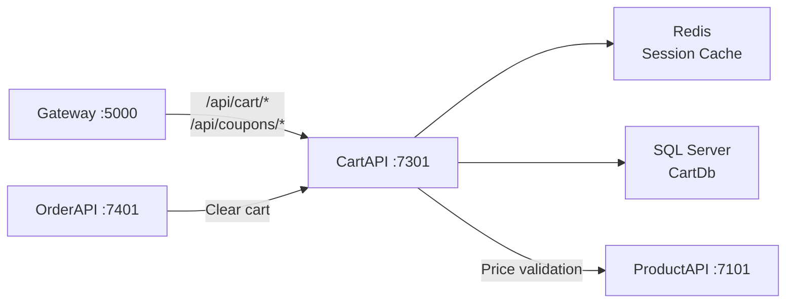
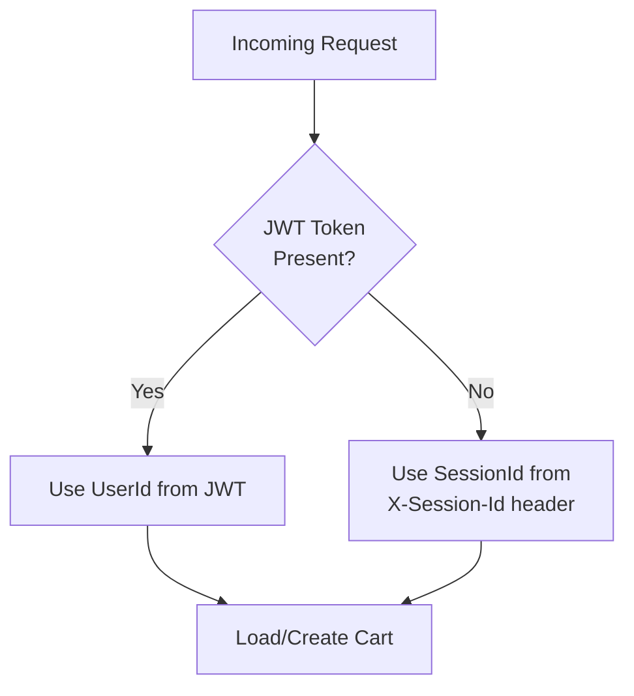

# DesiCorner.Services.CartAPI

**Shopping cart microservice with Redis session caching, coupon/discount validation, guest cart support, and admin coupon management.**

[]()
[]()
[]()

---

## Role in the System

CartAPI manages shopping cart state for both authenticated and guest users. Hot cart data is served from Redis for sub-millisecond reads, with SQL Server providing durability. Supports coupon application with percentage and fixed-amount discounts. After order placement, OrderAPI calls CartAPI to clear the cart.



**Communicates with:**
- **Gateway** ← receives routed requests from `/api/cart/*`, `/api/coupons/*`
- **Redis** → session-based cart caching for fast retrieval
- **SQL Server (CartDb)** → persistent cart state, coupon definitions
- **ProductAPI** → cross-service HTTP calls to validate product prices
- **OrderAPI** → receives cart-clearing calls after order placement

> 📖 For the overall system architecture, see the [root README](../README.md).

---

## Technology & Packages

| Package | Version | Purpose |
|---------|---------|---------|
| `Microsoft.AspNetCore.Authentication.JwtBearer` | 8.0.21 | Ensures authenticated users access only their own cart |
| `Microsoft.EntityFrameworkCore` | 8.0.21 | Core EF abstractions for cart data modeling |
| `Microsoft.EntityFrameworkCore.SqlServer` | 8.0.21 | Persistent cart state in SQL Server |
| `Microsoft.EntityFrameworkCore.Tools` | 8.0.21 | Migration tooling |
| `Newtonsoft.Json` | 13.0.4 | JSON serialization for complex nested cart objects where System.Text.Json has limitations |
| `StackExchange.Redis` | 2.10.1 | Session-based cart caching |
| `Swashbuckle.AspNetCore` | 9.0.6 | Swagger/OpenAPI documentation |

**Project References:** `DesCorner.Contracts`, `DesiCorner.MessageBus`

---

## API Endpoints

### Cart (`/api/cart`)

| Method | Endpoint | Auth | Description |
|--------|----------|------|-------------|
| `GET` | `/api/cart` | Session/Auth | Get cart (uses `X-Session-Id` header for guests) |
| `POST` | `/api/cart/add` | Session/Auth | Add item to cart |
| `PUT` | `/api/cart/update` | Session/Auth | Update cart item quantity |
| `DELETE` | `/api/cart/item/{cartItemId}` | Session/Auth | Remove item from cart |
| `DELETE` | `/api/cart/clear` | Session/Auth | Clear entire cart |
| `POST` | `/api/cart/apply-coupon` | Session/Auth | Apply coupon code |
| `POST` | `/api/cart/remove-coupon/{cartId}` | Session/Auth | Remove coupon from cart |

### Coupons -- Admin (`/api/coupons`)

| Method | Endpoint | Auth | Description |
|--------|----------|------|-------------|
| `GET` | `/api/coupons` | Admin | List all coupons with filtering |
| `GET` | `/api/coupons/{id}` | Admin | Get coupon by ID |
| `POST` | `/api/coupons` | Admin | Create coupon |
| `PUT` | `/api/coupons/{id}` | Admin | Update coupon |
| `DELETE` | `/api/coupons/{id}` | Admin | Delete coupon |
| `POST` | `/api/coupons/{id}/toggle` | Admin | Toggle coupon active/inactive |
| `GET` | `/api/coupons/stats` | Admin | Coupon statistics |

---

## Database Schema (CartDb)

**EF Core code-first** -- run `dotnet ef database update --project DesiCorner.Services.CartAPI` to create.

### Key Entities

- **Cart** -- `UserId` (nullable), `SessionId` (for guests), `CouponCode`, `DiscountAmount`, `SubTotal`, `TaxAmount`, `DeliveryFee`, `Total` (all computed), `CreatedAt`, `UpdatedAt`
- **CartItem** -- `ProductId`, `ProductName`, `ProductImage`, `Price`, `Quantity`, `Total` (computed: Price × Quantity)
- **Coupon** -- `Code`, `DiscountType` (percentage/fixed), `DiscountValue`, `MinOrderAmount`, `MaxDiscount`, `ExpiryDate`, `IsActive`, `UsageCount`, `MaxUsage`

### Cart Identification Strategy



- **Authenticated users:** Cart identified by `UserId` from JWT token
- **Guest users:** Cart identified by `SessionId` (UUID) sent via `X-Session-Id` header, generated by the Angular `GuestSessionService`

---

## Key Services

| Service | Purpose |
|---------|---------|
| CartService | Cart CRUD, price calculation (subtotal, tax, delivery fee, discount) |
| CouponService | Coupon validation rules (expiry, min amount, max usage, active status) |
| ProductService | Cross-service HTTP call to ProductAPI to validate product prices |

---

## Configuration

| Setting | Description | Example |
|---------|-------------|---------|
| `ConnectionStrings:DefaultConnection` | SQL Server for CartDb | `Server=.;Database=DesiCornerCart;...` |
| `ConnectionStrings:Redis` | Redis for session caching | `localhost:6379` |
| `ServiceUrls:ProductAPI` | ProductAPI base URL for price validation | `https://localhost:7101` |
| `JwtSettings:Authority` | AuthServer URL | `https://localhost:7001` |
| `JwtSettings:Audience` | JWT audience | `desicorner-api` |

---

## Running Independently

```bash
redis-cli ping

dotnet ef database update --project DesiCorner.Services.CartAPI

dotnet run --project DesiCorner.Services.CartAPI
# Running on https://localhost:7301
# Swagger: https://localhost:7301/swagger
```

**Dependencies:** Redis, SQL Server. ProductAPI should be running for price validation. AuthServer for JWT validation on authenticated endpoints.
