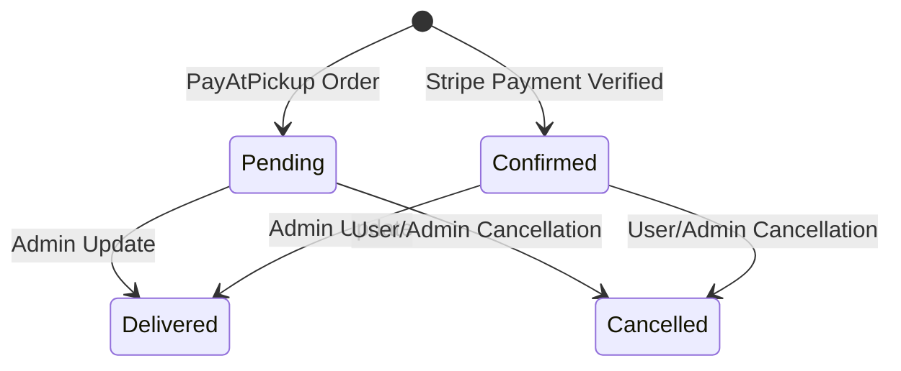

# DesiCorner.Services.OrderAPI

**Order processing microservice handling order creation, guest checkout with OTP verification, delivery/pickup options, order tracking, and admin order management.**

[]()
[]()
[]()

---

## Role in the System

OrderAPI processes orders for both authenticated and guest users. Supports delivery and scheduled pickup options. After order creation, it calls PaymentAPI via synchronous HTTP to verify payment, then updates the order status. It also calls CartAPI to clear the cart post-order. (Azure Service Bus event publishing is scaffolded but not yet active.)

**Communicates with:**
- **Gateway** <- receives routed requests from `/api/orders/*`
- **CartAPI** -> HTTP call to clear cart after order placement
- **PaymentAPI** -> HTTP call to verify payment status
- **MessageBus** -> project reference present (event publishing/consumption scaffolded, not yet active)
- **SQL Server (OrderDb)** -> orders, order items

> For the overall system architecture, see the [root README](../README.md).

---

## Technology & Packages

| Package | Version | Purpose |
|---------|---------|---------|
| `Microsoft.AspNetCore.Authentication.JwtBearer` | 8.0.21 | Secures order endpoints -- users access only their own orders |
| `Microsoft.EntityFrameworkCore.SqlServer` | 8.0.21 | Order records and line items in SQL Server |
| `Microsoft.EntityFrameworkCore.Tools` | 8.0.21 | Migration tooling |
| `Swashbuckle.AspNetCore` | 6.6.2 | Swagger/OpenAPI documentation |

**Project References:** `DesCorner.Contracts`, `DesiCorner.MessageBus`

---

## API Endpoints

### Orders (`/api/orders`)

| Method | Endpoint | Auth | Description |
|--------|----------|------|-------------|
| `POST` | `/api/orders` | Anonymous | Create order (authenticated + guest checkout) |
| `GET` | `/api/orders/{orderId}` | Anonymous* | Get order by ID (*guests can view within 5 minutes of creation) |
| `GET` | `/api/orders/number/{orderNumber}` | Bearer Token | Get order by order number |
| `GET` | `/api/orders/my-orders?page=1&pageSize=10` | Bearer Token | User's order history with pagination |
| `POST` | `/api/orders/{orderId}/cancel` | Bearer Token | Cancel an order |
| `PUT` | `/api/orders/status` | Admin | Update order status |
| `GET` | `/api/orders/admin/all` | Admin | All orders with filtering/pagination |
| `GET` | `/api/orders/admin/stats` | Admin | Order statistics |
| `GET` | `/api/orders/admin/recent?count=5` | Admin | Recent orders |

---

## Order Status Workflow



---

## Database Schema (OrderDb)

**EF Core code-first** -- run `dotnet ef database update --project DesiCorner.Services.OrderAPI` to create.

### Key Entities

- **Order** -- `OrderNumber`, `UserId` (nullable), `IsGuestOrder`, `UserEmail`, `UserPhone`, `OrderType` (enum: Delivery/Pickup), `DeliveryAddress`/`City`/`State`/`ZipCode` (nullable for pickup), `ScheduledPickupTime`, `SubTotal`, `TaxAmount`, `DeliveryFee`, `DiscountAmount`, `Total`, `CouponCode`, `Status` (Pending->Processing->Shipped->Delivered/Cancelled), `PaymentIntentId`, `PaymentStatus`, `PaymentMethod`, `OrderDate`, `EstimatedDeliveryTime`, `DeliveredAt`, `SpecialInstructions`
- **OrderItem** -- `ProductId`, `ProductName`, `ProductImage`, `Price`, `Quantity`, `OrderId` (FK)

---

## Key Services

| Service | Purpose |
|---------|---------|
| OrderService | Order creation, status updates, history retrieval, inter-service cart clearing |
| OtpService | OTP verification for guest checkout |
| UserService | User lookup for linking guest orders to accounts |

---

## Configuration

| Setting | Description | Example |
|---------|-------------|---------|
| `ConnectionStrings:DefaultConnection` | SQL Server for OrderDb | `Server=.;Database=DesiCornerOrder;...` |
| `ServiceUrls:CartAPI` | CartAPI URL for cart clearing | `https://localhost:7301` |
| `JwtSettings:Authority` | AuthServer URL | `https://localhost:7001` |
| `JwtSettings:Audience` | JWT audience | `desicorner-api` |

---

## Running Independently

```bash
dotnet ef database update --project DesiCorner.Services.OrderAPI

dotnet run --project DesiCorner.Services.OrderAPI
# Running on https://localhost:7401
# Swagger: https://localhost:7401/swagger
```

**Dependencies:** SQL Server. CartAPI should be running for post-order cart clearing. AuthServer for JWT validation.
