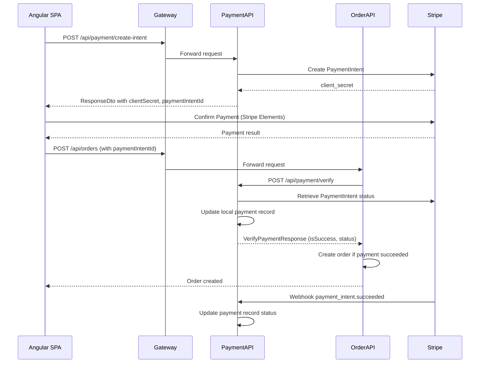

# DesiCorner.Services.PaymentAPI

**Stripe payment processing microservice handling payment intents, PCI-compliant card processing, webhook verification, and auditable transaction logging with Serilog.**

[]()
[]()
[]()

---

## Role in the System

PaymentAPI processes payments via Stripe's Payment Intents API. When the Angular frontend initiates checkout, it calls `create-intent` to get a `client_secret`, uses Stripe Elements (client-side) to collect card details — **raw card numbers never touch our server (PCI DSS compliance)** — and then the frontend confirms payment. Stripe sends async webhook events to confirm the payment status.

**Communicates with:**
- **Gateway** ← receives routed requests from `/api/payment/*`
- **Stripe** → external API for payment processing, webhook events
- **MessageBus** → project reference present (event consumption/publishing scaffolded, not yet active)
- **SQL Server (PaymentDb)** → payment records, transaction logs

> ⚠️ **No JWT Bearer authentication package.** Payment endpoints are called through the Gateway, which handles JWT validation before routing. The webhook endpoint uses Stripe signature verification instead.

> 📖 For the overall system architecture, see the [root README](../README.md).

---

## Technology & Packages

| Package | Version | Purpose |
|---------|---------|---------|
| `Stripe.net` | 50.0.0 | Official Stripe SDK — payment intents, webhooks, refunds |
| `Microsoft.EntityFrameworkCore.SqlServer` | 8.0.21 | Payment records and transaction logs in SQL Server |
| `Microsoft.EntityFrameworkCore.Design` | 8.0.21 | Design-time EF Core services for migrations |
| `Serilog.AspNetCore` | 8.0.3 | **Structured logging** — critical for payment services to have auditable, searchable logs of all financial transactions |
| `Swashbuckle.AspNetCore` | 6.6.2 | Swagger/OpenAPI documentation |

**Project References:** `DesCorner.Contracts`

---

## API Endpoints

### Payment (`/api/payment`)

| Method | Endpoint | Auth | Description |
|--------|----------|------|-------------|
| `POST` | `/api/payment/create-intent` | Anonymous | Create Stripe Payment Intent, returns `client_secret` for frontend |
| `POST` | `/api/payment/verify` | Anonymous | Verify payment status with Stripe after frontend completes |
| `GET` | `/api/payment/{paymentIntentId}` | Anonymous | Get payment details by Stripe Payment Intent ID |
| `POST` | `/api/payment/webhook` | Stripe Signature | Stripe webhook for async events (`payment_intent.succeeded`, `payment_intent.payment_failed`) |
| `GET` | `/api/payment/config` | Anonymous | Get Stripe publishable key for frontend initialization |

### Payment Flow



---

## Database Schema (PaymentDb)

**EF Core code-first** — run `dotnet ef database update --project DesiCorner.Services.PaymentAPI` to create.

### Key Entity

- **Payment** — `PaymentIntentId` (Stripe), `UserId` (nullable), `UserEmail`, `AmountInCents`, `Amount`, `Currency`, `Status` (requires_payment_method → processing → succeeded/failed), `PaymentMethodId`, `ChargeId`, `ErrorMessage`, `LastPaymentErrorCode`, `OrderId`, `ClientSecret`, `CreatedAt`, `UpdatedAt`

---

## Stripe Integration Notes

- **Test mode only** — uses `sk_test_*` and `pk_test_*` keys. No production keys are ever committed.
- **PCI DSS compliance** — raw card data is handled entirely by Stripe Elements on the client side. The server only sees Payment Intent IDs and tokens.
- **Webhook signature verification** — all webhook events are verified against the `Stripe:WebhookSecret` to prevent spoofed events.
- **Idempotency** — Payment Intents are idempotent by design (same `paymentIntentId` = same payment).

---

## Configuration

| Setting | Description | Example |
|---------|-------------|---------|
| `ConnectionStrings:DefaultConnection` | SQL Server for PaymentDb | `Server=.;Database=DesiCornerPayment;...` |
| `Stripe:SecretKey` | Stripe secret API key | `sk_test_...` *(use environment variable)* |
| `Stripe:PublishableKey` | Stripe publishable key | `pk_test_...` |
| `Stripe:WebhookSecret` | Stripe webhook signing secret | `whsec_...` *(use environment variable)* |

> ⚠️ **Never commit Stripe keys.** Use `dotnet user-secrets` or environment variables. Get free test keys at [dashboard.stripe.com](https://dashboard.stripe.com/register).

---

## Running Independently

```bash
dotnet ef database update --project DesiCorner.Services.PaymentAPI

dotnet run --project DesiCorner.Services.PaymentAPI
# Running on https://localhost:7501
# Swagger: https://localhost:7501/swagger
```

**Dependencies:** SQL Server. Requires valid Stripe test keys in configuration. For webhook testing, use [Stripe CLI](https://stripe.com/docs/stripe-cli): `stripe listen --forward-to https://localhost:7501/api/payment/webhook`
