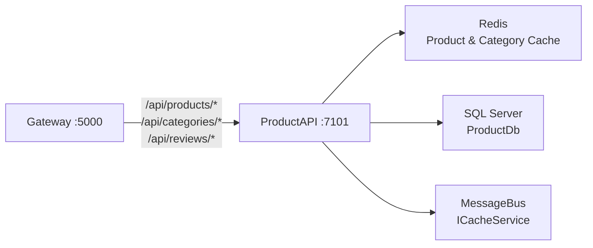
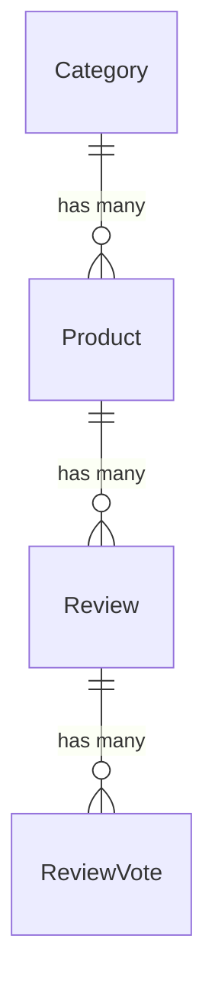

# DesiCorner.Services.ProductAPI

**Product catalog microservice managing products, categories, image uploads, and the complete reviews & ratings system with helpful voting.**

[]()
[]()
[]()

---

## Role in the System

ProductAPI serves the product catalog to the Angular frontend via the YARP Gateway. It handles CRUD for products and categories, image upload with local file storage, and a complete review/rating system with helpful voting and verified purchase badges. Product data is cached in Redis for fast reads.



**Communicates with:**
- **Gateway** <- receives routed requests from `/api/products/*`, `/api/categories/*`, `/api/reviews/*`
- **Redis** -> caches product listings and category data
- **SQL Server (ProductDb)** -> products, categories, reviews, review votes
- **MessageBus** -> uses `ICacheService` for product/category caching (event publishing scaffolded, not yet active)

> 📖 For the overall system architecture, see the [root README](../README.md).

---

## Technology & Packages

| Package | Version | Purpose |
|---------|---------|---------|
| `Microsoft.AspNetCore.Authentication.JwtBearer` | 8.0.21 | Secures write endpoints — only admins can create/update/delete |
| `Microsoft.EntityFrameworkCore.SqlServer` | 8.0.21 | ORM for product catalog data in SQL Server |
| `Microsoft.EntityFrameworkCore.Tools` | 8.0.21 | Migration CLI tooling |
| `StackExchange.Redis` | 2.9.32 | Caches product listings and category data |
| `Swashbuckle.AspNetCore` | 9.0.6 | Swagger/OpenAPI documentation |

**Project References:** `DesCorner.Contracts`, `DesiCorner.MessageBus`

---

## API Endpoints

### Products (`/api/products`)

| Method | Endpoint | Auth | Description |
|--------|----------|------|-------------|
| `GET` | `/api/products` | Anonymous | Get all products |
| `GET` | `/api/products/{id}` | Anonymous | Get product by ID |
| `GET` | `/api/products/category/{categoryId}` | Anonymous | Get products by category |
| `GET` | `/api/products/admin/stats` | Admin | Get product statistics |
| `POST` | `/api/products` | Admin | Create product (multipart/form-data with optional image) |
| `PUT` | `/api/products/{id}` | Admin | Update product (multipart/form-data with optional image) |
| `DELETE` | `/api/products/{id}` | Admin | Delete product |
| `POST` | `/api/products/{id}/image` | Admin | Upload/replace product image |
| `DELETE` | `/api/products/{id}/image` | Admin | Delete product image |

### Categories (`/api/categories`)

| Method | Endpoint | Auth | Description |
|--------|----------|------|-------------|
| `GET` | `/api/categories` | Anonymous | Get all categories |
| `GET` | `/api/categories/{id}` | Anonymous | Get category by ID |
| `POST` | `/api/categories` | Admin | Create category (multipart/form-data with optional image) |
| `PUT` | `/api/categories/{id}` | Admin | Update category |
| `DELETE` | `/api/categories/{id}` | Admin | Delete category |
| `POST` | `/api/categories/{id}/image` | Admin | Upload/replace category image |
| `DELETE` | `/api/categories/{id}/image` | Admin | Delete category image |

### Reviews (`/api/reviews`)

| Method | Endpoint | Auth | Description |
|--------|----------|------|-------------|
| `GET` | `/api/reviews/product/{productId}?page=1&pageSize=10&sortBy=newest` | Anonymous | Paginated reviews for a product |
| `GET` | `/api/reviews/product/{productId}/summary` | Anonymous | Review summary/statistics |
| `GET` | `/api/reviews/{reviewId}` | Anonymous | Single review by ID |
| `GET` | `/api/reviews/product/{productId}/my-review` | Bearer Token | Current user's review for a product |
| `POST` | `/api/reviews` | Bearer Token | Create a review |
| `PUT` | `/api/reviews/{reviewId}` | Bearer Token | Update review (author only) |
| `DELETE` | `/api/reviews/{reviewId}` | Bearer Token | Delete review (author or admin) |
| `POST` | `/api/reviews/{reviewId}/vote` | Bearer Token | Vote helpful/not helpful |

---

## Database Schema (ProductDb)

**EF Core code-first** — run `dotnet ef database update --project DesiCorner.Services.ProductAPI` to create.

### Key Entities

- **Product** — `Name`, `Description`, `Price`, `ImageUrl`, `CategoryId` (FK), `IsAvailable`, `IsVegetarian`, `IsVegan`, `IsSpicy`, `SpiceLevel` (0-5), `Allergens`, `PreparationTime`, `AverageRating` (computed), `ReviewCount` (computed), `CreatedAt`, `UpdatedAt`
- **Category** — `Name`, `Description`, `ImageUrl`, `DisplayOrder`
- **Review** — `ProductId`, `UserId`, `UserName`, `UserEmail`, `Rating` (1-5), `Title`, `Comment`, `IsVerifiedPurchase`, `IsApproved`, `HelpfulCount`, `NotHelpfulCount`, `CreatedAt`
- **ReviewVote** — `ReviewId`, `UserId`, `IsHelpful` (boolean)

### Relationships



---

## Key Services

| Service | File | Purpose |
|---------|------|---------|
| ProductService | `Services/ProductService.cs` | Product CRUD, search, filtering, pagination |
| CategoryService | `Services/CategoryService.cs` | Category CRUD |
| ReviewService | `Services/ReviewService.cs` | Review CRUD, voting, rating recalculation |
| ImageStorageService | `Services/LocalImageStorageService.cs` | Local filesystem image storage with GUID-based naming |

---

## Configuration

| Setting | Description | Example |
|---------|-------------|---------|
| `ConnectionStrings:DefaultConnection` | SQL Server for ProductDb | `Server=.;Database=DesiCornerProduct;...` |
| `ConnectionStrings:Redis` | Redis for caching | `localhost:6379` |
| `JwtSettings:Authority` | AuthServer URL for JWKS | `https://localhost:7001` |
| `JwtSettings:Audience` | Expected JWT audience | `desicorner-api` |
| `ImageStorage:BasePath` | Local path for uploaded images | `wwwroot/uploads` |

---

## Running Independently

```bash
# Ensure Redis is running
redis-cli ping

# Run database migrations
dotnet ef database update --project DesiCorner.Services.ProductAPI

# Start the service
dotnet run --project DesiCorner.Services.ProductAPI
# Running on https://localhost:7101

# Verify: https://localhost:7101/swagger
```

**Dependencies:** Requires Redis and SQL Server. Requires AuthServer running for JWT validation on write endpoints (read endpoints work without auth).
