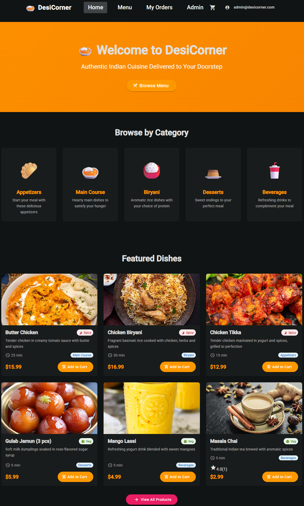
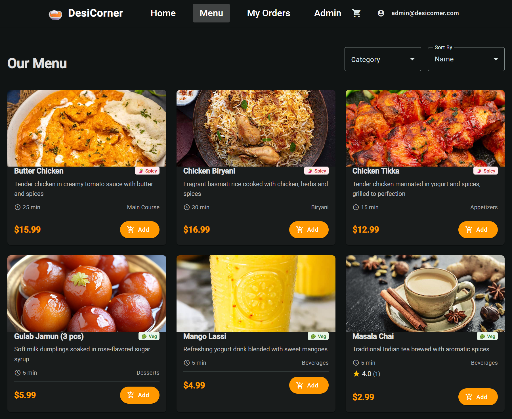
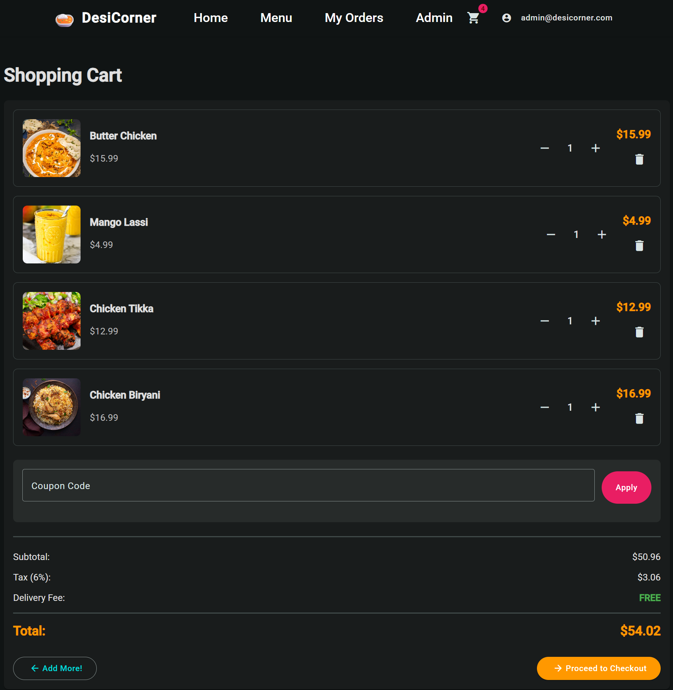
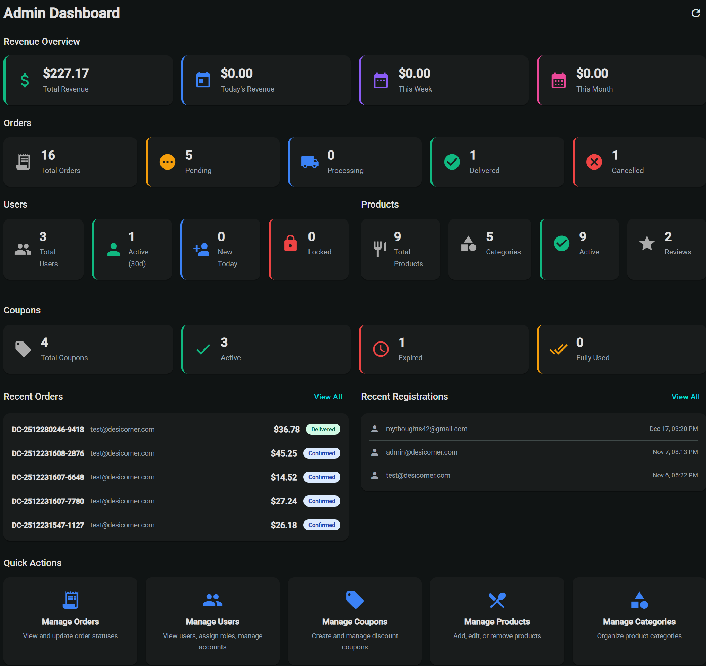
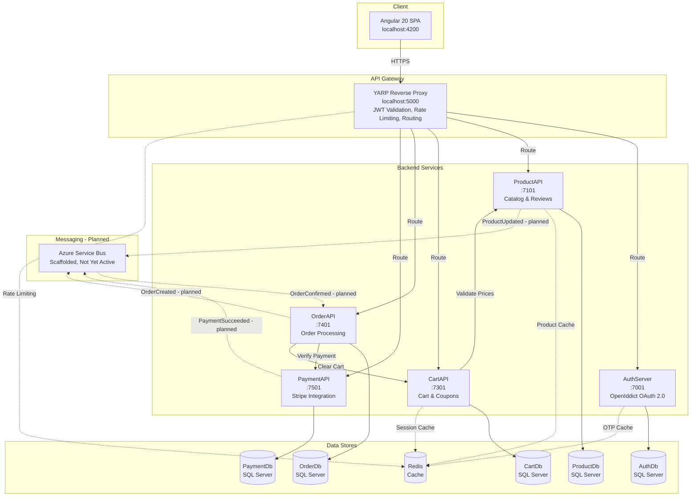

<div align="center">

# DesiCorner

**Production-Grade Microservices E-Commerce Platform for Indian Cuisine**

[]()
[]()
[]()
[]()
[]()
[]()
[]()

*A 9-service microservices architecture demonstrating distributed system patterns — OAuth 2.0, API gateway routing, distributed caching, and PCI-compliant payments.*

</div>

---

<div align="center">

| Homepage | Menu | Cart |
|----------|------|------|
|  |  |  |

| Checkout | Admin Dashboard |
|----------|-----------------|
|  |  |

</div>

---

<p align="center">
  <a href="#architecture-overview">Architecture</a> &bull;
  <a href="#tech-stack">Tech Stack</a> &bull;
  <a href="#getting-started">Getting Started</a> &bull;
  <a href="#api-documentation">API Docs</a> &bull;
  <a href="#project-structure">Project Structure</a>
</p>

<details>
<summary>Table of Contents</summary>

- [Architecture Overview](#architecture-overview)
- [Service Inventory](#service-inventory)
- [Tech Stack](#tech-stack)
- [Key Features](#key-features)
- [Getting Started](#getting-started)
  - [Prerequisites](#prerequisites)
  - [Option 1: Docker Compose](#option-1-docker-compose-recommended)
  - [Option 2: Manual Setup](#option-2-manual-setup)
- [Project Structure](#project-structure)
- [API Documentation](#api-documentation)
- [Architectural Decisions](#architectural-decisions)
- [Development Process](#development-process)
- [Roadmap](#roadmap)
- [License](#license)

</details>

---

## Architecture Overview



### Service Inventory

| Service | Port | Technology | Database | Description |
|---------|------|-----------|----------|-------------|
| **[AuthServer](./DesiCorner.AuthServer/)** | 7001 | .NET 8, OpenIddict 7.1, MailKit | SQL Server (AuthDb) | OAuth 2.0/OpenID Connect identity provider with JWT tokens, OTP verification, role management |
| **[ProductAPI](./DesiCorner.Services.ProductAPI/)** | 7101 | .NET 8, EF Core | SQL Server (ProductDb) | Product catalog, categories, image upload, reviews & ratings system |
| **[CartAPI](./DesiCorner.Services.CartAPI/)** | 7301 | .NET 8, Redis, EF Core | SQL Server (CartDb) + Redis | Shopping cart with Redis session caching, coupon/discount system |
| **[OrderAPI](./DesiCorner.Services.OrderAPI/)** | 7401 | .NET 8, EF Core | SQL Server (OrderDb) | Order processing, guest checkout, delivery/pickup options |
| **[PaymentAPI](./DesiCorner.Services.PaymentAPI/)** | 7501 | .NET 8, Stripe.NET 50.0, Serilog | SQL Server (PaymentDb) | Stripe payment intents, webhooks, PCI-compliant card processing |
| **[Gateway](./DesiCorner.Gateway/)** | 5000 | YARP 2.3, OpenTelemetry | — | Reverse proxy with JWT validation, rate limiting, distributed tracing |
| **[MessageBus](./DesiCorner.MessageBus/)** | — | Redis (caching), Azure Service Bus (scaffolded) | — | Redis caching abstraction (active). Azure Service Bus messaging scaffolded but not yet active at runtime |
| **[Contracts](./DesCorner.Contracts/)** | — | .NET 8 (pure library) | — | Shared DTOs across 9 subdomains |
| **[Frontend](./desicorner-angular/)** | 4200 | Angular 20, NgRx, Angular Material | — | SPA with OAuth 2.0 PKCE, Stripe Elements, responsive Material Design |

---

## Tech Stack

### Backend

| Technology | Version | Purpose |
|-----------|---------|---------|
| .NET | 8.0 LTS | Microservices framework |
| Entity Framework Core | 8.0.21 | ORM with code-first migrations |
| OpenIddict | 7.1.0 | OAuth 2.0 / OpenID Connect server |
| YARP | 2.3.0 | Reverse proxy API gateway |
| Stripe.NET | 50.0.0 | Payment processing |
| Azure Service Bus | 7.20.1 | Async messaging (scaffolded, not yet active) |
| StackExchange.Redis | 2.9–2.10 | Distributed caching (active), pub/sub (not yet active) |
| OpenTelemetry | 1.13.x | Distributed tracing |
| Serilog | 8.0.3 | Structured logging |
| Swashbuckle | 6.6–9.0 | Swagger/OpenAPI docs |
| MailKit | 4.14.1 | SMTP email |
| Twilio | 7.13.5 | SMS/OTP verification |

### Frontend

| Technology | Version | Purpose |
|-----------|---------|---------|
| Angular | 20.x | SPA framework |
| TypeScript | 5.9.2 | Type-safe development |
| NgRx | 20.1.0 | Redux-style state management |
| Angular Material | 20.2.11 | Material Design UI components |
| angular-oauth2-oidc | 20.0.2 | OAuth 2.0 / PKCE client |
| ngx-stripe | 21.8.0 | Stripe Elements integration |
| RxJS | 7.8.0 | Reactive programming |

### Infrastructure

| Technology | Purpose |
|-----------|---------|
| SQL Server | Relational databases (5 separate DBs — database-per-service) |
| Redis | Distributed caching, session management, rate limiting |
| Docker | Containerization (coming soon) |
| Git + GitHub | Branch-per-feature workflow with 22 merged PRs |

---

## Key Features

### Architecture & Infrastructure
- **Microservices Architecture** — 9 independently deployable services with database-per-service pattern
- **API Gateway** — YARP reverse proxy with request routing, JWT validation, and Redis-based rate limiting
- **Event-Driven Messaging (Scaffolded)** — Azure Service Bus infrastructure is implemented (publisher, consumer, message types) but not yet active at runtime. Inter-service communication currently uses synchronous HTTP. Planned for activation in a future phase
- **Distributed Caching** — Redis for session management, product caching, rate limiting, and OTP storage
- **Observability** — OpenTelemetry distributed tracing across all services with Serilog structured logging
- **Shared Contracts** — DTO library across 9 subdomains ensuring type-safe inter-service communication

### Authentication & Security
- **OAuth 2.0 / OpenID Connect** — Full implementation with OpenIddict (authorization code + PKCE flow)
- **JWT Authentication** — Stateless token-based auth with dual Cookie+JWT scheme support
- **Role-Based Access Control** — Admin and Customer roles with per-endpoint authorization
- **OTP Verification** — Redis-backed OTP for registration and guest checkout (SMS via Twilio, Email via MailKit)

### Business Features
- **Product Catalog** — Categories, search, filtering, image upload with local storage
- **Reviews & Ratings** — Star ratings, written reviews, helpful/not-helpful voting, verified purchase badges
- **Shopping Cart** — Authenticated + guest cart with Redis session caching
- **Coupon System** — Percentage and fixed-amount discounts with validation rules
- **Order Processing** — Delivery and pickup options, order tracking, status workflow
- **Guest Checkout** — Full checkout without registration using OTP verification
- **Stripe Payments** — PCI-compliant payment intents, card processing, webhook handling
- **Admin Dashboard** — Analytics, product/category/coupon management, user/role management, order management

---

## Getting Started

### Prerequisites

| Tool | Version | Verify | Install |
|------|---------|--------|---------|
| .NET SDK | 8.0+ | `dotnet --version` | [dotnet.microsoft.com](https://dotnet.microsoft.com/download/dotnet/8.0) |
| Node.js | 18+ | `node --version` | [nodejs.org](https://nodejs.org/) |
| Angular CLI | 20.x | `ng version` | `npm install -g @angular/cli` |
| SQL Server | 2019+ | — | [SQL Server](https://www.microsoft.com/en-us/sql-server/sql-server-downloads) or Docker image |
| Redis | 7.0+ | `redis-cli ping` | [redis.io](https://redis.io/download) or Docker image |
| Stripe Account | Free test keys | — | [dashboard.stripe.com](https://dashboard.stripe.com/register) |

### Option 1: Docker Compose (Recommended)

> Docker support coming soon. See [Option 2: Manual Setup](#option-2-manual-setup) below.

### Option 2: Manual Setup

#### 1. Clone & Configure

```bash
git clone https://github.com/HariVenkataKrishnaKotha/DesiCorner.git
cd DesiCorner
```

Update `appsettings.json` in each service with:
- SQL Server connection strings (each service uses its own database)
- Redis connection string
- Stripe API keys (PaymentAPI)
- SMTP credentials (AuthServer)
- Twilio credentials (AuthServer — optional)

#### 2. Start Redis

```bash
# If using Docker for Redis only:
docker run -d --name redis -p 6379:6379 redis:7-alpine

# Verify:
redis-cli ping
# Expected: PONG
```

#### 3. Run Database Migrations (Code-First — no manual DB setup needed)

```bash
# AuthServer database
dotnet ef database update --project DesiCorner.AuthServer

# ProductAPI database
dotnet ef database update --project DesiCorner.Services.ProductAPI

# CartAPI database
dotnet ef database update --project DesiCorner.Services.CartAPI

# OrderAPI database
dotnet ef database update --project DesiCorner.Services.OrderAPI

# PaymentAPI database
dotnet ef database update --project DesiCorner.Services.PaymentAPI
```

> **Note:** EF Core code-first migrations create all 5 databases automatically. You only need SQL Server running — no manual schema setup required.

#### 4. Start Backend Services (each in a separate terminal)

```bash
dotnet run --project DesiCorner.AuthServer          # Port 7001
dotnet run --project DesiCorner.Gateway              # Port 5000
dotnet run --project DesiCorner.Services.ProductAPI  # Port 7101
dotnet run --project DesiCorner.Services.CartAPI     # Port 7301
dotnet run --project DesiCorner.Services.OrderAPI    # Port 7401
dotnet run --project DesiCorner.Services.PaymentAPI  # Port 7501
```

#### 5. Start Angular Frontend

```bash
cd desicorner-angular
npm install
ng serve    # Port 4200
```

#### 6. Verify Setup

- Open http://localhost:4200 — you should see the DesiCorner homepage
- Open https://localhost:7001/swagger — AuthServer API docs
- Try the login flow, browse products, add to cart

**Service Access Points:**

| Service | URL |
|---------|-----|
| Frontend | http://localhost:4200 |
| API Gateway | https://localhost:5000 |
| AuthServer Swagger | https://localhost:7001/swagger |
| ProductAPI Swagger | https://localhost:7101/swagger |
| CartAPI Swagger | https://localhost:7301/swagger |
| OrderAPI Swagger | https://localhost:7401/swagger |
| PaymentAPI Swagger | https://localhost:7501/swagger |

---

## Project Structure

```
DesiCorner/
├── DesCorner.Contracts/            # Shared DTOs — 9 subdomains
│   ├── Admin/                      #   DashboardStatsDto
│   ├── Auth/                       #   Login, Register, User, OTP, Address, AdminUser DTOs
│   ├── Cart/                       #   Cart, CartItem, Coupon DTOs
│   ├── Common/                     #   ResponseDto, PaginatedResponse
│   ├── Coupons/                    #   Coupon, AdminCoupon, validation DTOs
│   ├── Orders/                     #   Order, OrderItem, OrderStatus, AdminOrder DTOs
│   ├── Payment/                    #   PaymentIntent, Webhook, VerifyPayment DTOs
│   ├── Products/                   #   Product, Category, ProductStats DTOs
│   └── Reviews/                    #   Review, ReviewSummary, ReviewVote DTOs
│
├── DesiCorner.AuthServer/          # OAuth 2.0 Identity Server (Port 7001)
│   ├── Controllers/                #   AccountController, AuthorizationController, AdminController
│   ├── Data/                       #   ApplicationDbContext, DataProtectionKeyContext
│   ├── Identity/                   #   ApplicationUser, ApplicationRole, DeliveryAddress
│   ├── Infrastructure/             #   OpenIddict client seeding
│   ├── Models/                     #   View models and request models
│   └── Services/                   #   TokenService, EmailService, OtpService
│
├── DesiCorner.Gateway/             # YARP API Gateway (Port 5000)
│   ├── Auth/                       #   TokenAuthenticator, JwksProvider, RateLimiter
│   ├── Infrastructure/             #   Middleware, configuration helpers
│   ├── Policies/                   #   ScopeAuthorizationHandler
│   └── Transforms/                 #   ForwardingTransforms
│
├── DesiCorner.MessageBus/          # Shared Messaging Library
│   ├── Extensions/                 #   Service collection extensions
│   ├── Messages/                   #   OrderCreated, PaymentSucceeded events
│   ├── Redis/                      #   CacheService abstraction
│   └── ServiceBus/                 #   Azure Service Bus publisher/consumer
│
├── DesiCorner.Services.ProductAPI/ # Product Catalog Service (Port 7101)
│   ├── Controllers/                #   ProductsController, CategoriesController, ReviewsController
│   ├── Data/                       #   ApplicationDbContext
│   ├── Models/                     #   Product, Category, Review, ReviewVote
│   └── Services/                   #   ProductService, CategoryService, ReviewService, ImageStorageService
│
├── DesiCorner.Services.CartAPI/    # Shopping Cart Service (Port 7301)
│   ├── Controllers/                #   CartController, CouponsController
│   ├── Data/                       #   ApplicationDbContext
│   ├── Models/                     #   Cart, CartItem, Coupon
│   └── Services/                   #   CartService, CouponService
│
├── DesiCorner.Services.OrderAPI/   # Order Processing Service (Port 7401)
│   ├── Controllers/                #   OrdersController
│   ├── Data/                       #   ApplicationDbContext
│   ├── Models/                     #   Order, OrderItem
│   └── Services/                   #   OrderService, OtpService, UserService
│
├── DesiCorner.Services.PaymentAPI/ # Stripe Payment Service (Port 7501)
│   ├── Controllers/                #   PaymentController
│   ├── Data/                       #   ApplicationDbContext
│   ├── Models/                     #   Payment
│   └── Services/                   #   PaymentService
│
├── desicorner-angular/             # Angular 20 SPA (Port 4200)
│   └── src/app/
│       ├── core/                   #   Guards, Interceptors, Models, Services
│       ├── features/               #   Home, Auth, Admin, Cart, Checkout, Products, Profile, Orders
│       └── shared/                 #   Header, Footer, StarRating, ReviewForm components
│
├── docs/                           # Documentation & images
│   └── images/                     #   Screenshots
│
├── DesiCorner.sln                  # .NET Solution file
└── README.md                       # You are here
```

---

## API Documentation

Every backend service exposes interactive **Swagger UI** documentation:

| Service | Swagger URL | Key Endpoints |
|---------|------------|---------------|
| AuthServer | `localhost:7001/swagger` | `POST /api/account/login`, `POST /api/account/register`, `GET /api/account/profile` |
| ProductAPI | `localhost:7101/swagger` | `GET /api/products`, `GET /api/categories`, `POST /api/reviews` |
| CartAPI | `localhost:7301/swagger` | `GET /api/cart`, `POST /api/cart/add`, `POST /api/cart/apply-coupon` |
| OrderAPI | `localhost:7401/swagger` | `POST /api/orders`, `GET /api/orders/my-orders` |
| PaymentAPI | `localhost:7501/swagger` | `POST /api/payment/create-intent`, `POST /api/payment/verify` |

> All endpoints (except login/register) require a JWT Bearer token. Use the AuthServer login endpoint to obtain a token, then use the "Authorize" button in Swagger UI to set it.

See each service's individual README for complete endpoint documentation.

---

## Architectural Decisions

| Decision | Choice | Why |
|----------|--------|-----|
| Auth framework | OpenIddict 7.1 over IdentityServer | OpenIddict is fully open-source (Apache 2.0), actively maintained, and natively integrates with ASP.NET Core Identity. IdentityServer moved to a commercial license. |
| API Gateway | YARP over Ocelot | YARP is Microsoft's official production-grade reverse proxy (used in Azure services). Higher throughput, direct .NET team support, and more flexible routing configuration. |
| Database strategy | Database-per-service | Each microservice owns its data. Ensures loose coupling — services can be deployed, scaled, and migrated independently. |
| Cart caching | Redis alongside SQL Server | Hot cart data served from Redis (sub-millisecond reads). SQL Server provides durability. Cart survives Redis eviction. |
| Messaging | Azure Service Bus (scaffolded) | Service Bus infrastructure is implemented but not yet active. Currently all inter-service communication is synchronous HTTP. Planned for eventual consistency patterns (order-to-payment). |
| Frontend state | NgRx (Redux pattern) | Predictable state management for complex cart/auth/catalog interactions. DevTools integration for debugging. |
| Auth flow | JWT + PKCE (not cookies-only) | Stateless JWT tokens work across microservices without shared session state. PKCE prevents authorization code interception for public SPA clients. |
| Payment processing | Stripe Elements (client-side) | PCI DSS compliance — raw card numbers never touch our servers. Stripe handles all card data. |

---

## Development Process

This project was developed using **AI pair programming** (Claude Code) as a development accelerator over a 7-week active development period (Nov 4 – Dec 23, 2025), following an initial MVC scaffold built in January 2023.

### My Role: Architect & Technical Lead
- Designed the microservices architecture and defined all service boundaries
- Selected every technology: OpenIddict over IdentityServer, YARP over Ocelot, Redis for distributed caching, Azure Service Bus for future async messaging
- Defined all domain models and business rules (Indian restaurant domain knowledge)
- Independently debugged 7 of 8 production bugs — including a critical 3-bug JWT authentication chain across 4 services (audience mismatch + JWKS key validation + CORS trailing slash)
- Managed the complete Git workflow: 15 feature branches, 22 merged PRs
- Handled all security: caught and reverted a Stripe API key exposure within minutes
- Performed all configuration, testing, and validation

### Claude Code's Role: Implementation Accelerator
- Translated architecture decisions and requirements into implementation code
- Generated scaffolds, service layers, Angular components at scale
- Implemented standard patterns (repository, DI, interceptors, guards)
- Helped implement fixes after I identified root causes

### Development Workflow
```
Architecture Decision (Me) --> Requirements Spec (Me) --> Implementation (Claude Code)
    --> Code Review (Me) --> Integration Testing (Me) --> Bug Diagnosis (Me)
    --> Fix Implementation (Me + Claude Code) --> Git Management (Me)
```

This workflow mirrors modern AI-augmented development practices. The distinction between directing AI tooling and writing code from scratch is less relevant than the ability to **design systems, debug distributed architectures, and make sound technical decisions** — skills that AI assistants cannot replace.

### Development Stats

| Metric | Value |
|--------|-------|
| Active development period | 7 weeks |
| Total commits | 48 |
| Feature branches | 15 |
| Merged pull requests | 22 |
| Bugs encountered & resolved | 8/8 (100%) |
| Databases | 5 (separate per microservice) |
| Shared DTO contracts | 44 files |

---

## Roadmap

### Completed
- [x] Microservices architecture with YARP Gateway
- [x] OAuth 2.0 / OpenID Connect (OpenIddict)
- [x] Product catalog with categories, search, image upload
- [x] Reviews & ratings with voting system
- [x] Shopping cart (authenticated + guest) with Redis caching
- [x] Coupon/discount system
- [x] Order processing (delivery + pickup)
- [x] Guest checkout with OTP verification
- [x] Stripe payment integration
- [x] Admin dashboard with analytics
- [x] OpenTelemetry distributed tracing (Gateway)
- [x] NgRx state management

### Planned
- [ ] Activate Azure Service Bus event-driven messaging (infrastructure already scaffolded)
- [ ] Docker containerization with docker-compose
- [ ] CI/CD pipeline (GitHub Actions)
- [ ] Unit and integration testing (xUnit/NUnit)
- [ ] Real-time order updates (SignalR)
- [ ] Performance optimization and load testing
- [ ] Production deployment guide

---

## License

This project is licensed under the MIT License — see the [LICENSE](LICENSE.txt) file for details.
