# DesiCorner - Comprehensive Development Report

**Project:** DesiCorner - Indian Restaurant E-Commerce Platform
**Author:** Hari Venkata Krishna Kotha
**Repository:** [github.com/HariVenkataKrishnaKotha/DesiCorner](https://github.com/HariVenkataKrishnaKotha/DesiCorner)
**Report Generated:** February 11, 2026
**Total Development Period:** January 4, 2023 (initial scaffold) - February 11, 2026 (NgRx, PKCE, Mermaid diagrams)
**Total Commits:** 48 commits across 15 branches
**Total Pull Requests:** 22 merged PRs

---

## Table of Contents

1. [Project Overview & Vision](#1-project-overview--vision)
2. [Technology Stack](#2-technology-stack)
3. [Architecture Overview](#3-architecture-overview)
4. [Complete Development Timeline (Atomic Level)](#4-complete-development-timeline-atomic-level)
   - [Phase 1: Initial Scaffold (Jan 2023)](#phase-1-initial-scaffold-january-4-6-2023)
   - [Phase 2: Architecture Reboot (Nov 4, 2025)](#phase-2-architecture-reboot-november-4-2025)
   - [Phase 3: Product API & Gateway (Nov 5, 2025)](#phase-3-product-api--gateway-wiring-november-5-2025)
   - [Phase 4: Angular Frontend Foundation (Nov 5, 2025)](#phase-4-angular-frontend-foundation-november-5-2025)
   - [Phase 5: Authentication - Login & Cart (Nov 6-8, 2025)](#phase-5-authentication---login-cart--jwt-november-6-8-2025)
   - [Phase 6: JWT Remaster - Critical Bug Fixes (Nov 13, 2025)](#phase-6-jwt-remaster---critical-bug-fixes-november-13-2025)
   - [Phase 7: UI Login/Profile & Image Upload (Nov 18, 2025)](#phase-7-ui-loginprofile--image-upload-november-18-2025)
   - [Phase 8: Cart API & Angular Cart (Nov 19-21, 2025)](#phase-8-cart-api--angular-cart-integration-november-19-21-2025)
   - [Phase 9: Order API Backend (Nov 21, 2025)](#phase-9-order-api-backend-november-21-2025)
   - [Phase 10: Checkout & Guest Orders (Nov 25 - Dec 3, 2025)](#phase-10-checkout--guest-order-support-november-25---december-3-2025)
   - [Phase 11: Order History & Cart Integration (Dec 3-4, 2025)](#phase-11-order-history--order-cart-integration-december-3-4-2025)
   - [Phase 12: Stripe Payment Integration (Dec 5, 2025)](#phase-12-stripe-payment-integration-december-5-2025)
   - [Phase 13: User Profile & Registration (Dec 16, 2025)](#phase-13-user-profile--registration-workflow-december-16-2025)
   - [Phase 14: Reviews & Ratings (Dec 17, 2025)](#phase-14-reviews--ratings-system-december-17-2025)
   - [Phase 15: Admin Dashboard (Dec 18-23, 2025)](#phase-15-admin-dashboard-december-18-23-2025)
   - [Phase 16: Documentation & Dark Theme (Feb 7-9, 2026)](#phase-16-documentation-dark-theme--diagram-verification-february-7-9-2026)
   - [Phase 17: NgRx State Management (Feb 10, 2026)](#phase-17-ngrx-state-management-february-10-2026)
   - [Phase 18: OAuth 2.0 PKCE Implementation (Feb 10-11, 2026)](#phase-18-oauth-20-pkce-implementation-february-10-11-2026)
   - [Phase 19: Mermaid Diagrams & README Updates (Feb 11, 2026)](#phase-19-mermaid-diagrams--readme-updates-february-11-2026)
5. [Bugs Encountered & Resolutions](#5-bugs-encountered--resolutions)
6. [Contributions Breakdown](#6-contributions-breakdown---hari-vs-claude-ai)
7. [Microservices Detail](#7-microservices-detail)
8. [Angular Frontend Detail](#8-angular-frontend-detail)
9. [Data Models & Entity Relationships](#9-data-models--entity-relationships)
10. [Pull Request History](#10-pull-request-history)
11. [Project Statistics](#11-project-statistics)
12. [Current State & Roadmap](#12-current-state--roadmap)

---

## 1. Project Overview & Vision

DesiCorner is a **production-grade Indian restaurant e-commerce platform** built with a microservices architecture. The project demonstrates modern full-stack development practices including Domain-Driven Design (DDD), Clean Architecture, OAuth 2.0 security, and distributed caching.

**Core Business Features:**
- Browse and order Indian cuisine online
- Authenticated and guest checkout
- Stripe payment processing
- Product reviews and ratings
- Admin dashboard with analytics
- Coupon/discount system
- Delivery and pickup options
- User profiles with multiple delivery addresses
- Order tracking and history

---

## 2. Technology Stack

### Backend (.NET Core 8)
| Technology | Purpose |
|---|---|
| ASP.NET Core 8 | Web API framework for all microservices |
| Entity Framework Core | ORM & data access with code-first migrations |
| YARP (Yet Another Reverse Proxy) | API Gateway with routing, load balancing, rate limiting |
| OpenIddict | OAuth 2.0 / OpenID Connect authentication server |
| SQL Server | Relational database (separate DB per microservice) |
| Redis (StackExchange.Redis) | Distributed caching, session management, rate limiting |
| Stripe.NET | Payment processing integration |
| OpenTelemetry | Distributed tracing and metrics |

### Frontend (Angular 20)
| Technology | Purpose |
|---|---|
| Angular 20 | Standalone component-based SPA with signals |
| TypeScript 5.9 | Type-safe frontend development |
| NgRx 20.1 | Redux-inspired state management (Auth, Cart, Products stores) |
| RxJS | Reactive programming |
| Angular Material 20 | Material Design UI component library |
| angular-oauth2-oidc | OAuth 2.0 / OIDC client (Authorization Code + PKCE, token refresh) |
| ngx-stripe | Angular wrapper for Stripe Elements (PCI-compliant payment forms) |
| SCSS | Advanced stylesheet preprocessing with dark theme support |
| ngx-toastr | Toast notification system |
| crypto-js | Client-side cryptographic utilities |
| uuid | UUID generation for idempotency keys and guest sessions |

### Infrastructure
| Technology | Purpose |
|---|---|
| Git + GitHub | Version control with branch-per-feature workflow |
| Docker (planned) | Containerization |
| Swagger/OpenAPI | API documentation |

---

## 3. Architecture Overview


**Solution Projects (9 total):**
1. `DesCorner.Contracts` - Shared DTOs (41 contract files across 9 subdomains)
2. `DesiCorner.AuthServer` - Identity, OAuth 2.0, user management
3. `DesiCorner.Gateway` - YARP reverse proxy, JWT validation, rate limiting
4. `DesiCorner.MessageBus` - Redis caching abstractions (Azure Service Bus scaffolded but not yet active)
5. `DesiCorner.Services.ProductAPI` - Product catalog, categories, reviews
6. `DesiCorner.Services.CartAPI` - Shopping cart, coupons
7. `DesiCorner.Services.OrderAPI` - Order processing, guest orders
8. `DesiCorner.Services.PaymentAPI` - Stripe payment processing
9. `desicorner-angular` - Angular 20 frontend SPA

---

## 4. Complete Development Timeline (Atomic Level)

---

### Phase 1: Initial Scaffold (January 4-6, 2023)

**Context:** The project started as a traditional ASP.NET Core MVC application before the microservices rewrite.

#### Commit `5f3d511` - Jan 4, 2023
**"Add .gitattributes, .gitignore, README.md, and LICENSE.txt"**
- Initialized the GitHub repository
- Added MIT License
- Created initial `.gitignore` for .NET projects
- **Who:** Hari (hvkkotha)

#### Commit `661fa4c` - Jan 4, 2023
**"Add project files"**
- Created the initial ASP.NET Core MVC project `DesiCorner.csproj`
- Files added:
  - `Controllers/HomeController.cs` - Default MVC controller
  - `Models/ErrorViewModel.cs` - Error handling model
  - `Program.cs` - Application entry point
  - `Views/Home/Index.cshtml`, `Privacy.cshtml` - Basic Razor views
  - `Views/Shared/_Layout.cshtml` - Master layout
  - Bootstrap libraries (full distribution), jQuery, jQuery Validation
  - `appsettings.json`, `launchSettings.json`
- **Who:** Hari (hvkkotha)

#### Commit `52131d0` - Jan 6, 2023
**"Added Data Models for the web application"**
- Created domain models with repository pattern:
  - `Models/Category.cs` - Food category entity
  - `Models/Dish.cs` - Dish/food item entity
  - `Models/ICategoryRepository.cs` - Category repository interface
  - `Models/IDishRepository.cs` - Dish repository interface
  - `Models/MockCategoryRepository.cs` - In-memory category data
  - `Models/MockDishRepository.cs` - In-memory dish data
- Modified `Program.cs` to register DI services
- **Who:** Hari (hvkkotha)

#### Commit `3cf63e6` - Jan 6, 2023
**"Added basic controller class and view page to test the application functionality"**
- `Controllers/DishController.cs` - Dish listing controller
- `ViewModels/DishListViewModel.cs` - View model for dish list
- `Views/Dish/List.cshtml` - Razor view for dish listing
- Modified `DesiCorner.csproj` for additional packages
- **Who:** Hari (hvkkotha)

#### Commit `4f20fcb` - Jan 6, 2023
**"Added bootstrap support and styling for the added views"**
- Updated `MockDishRepository.cs` with sample dish data
- Enhanced `Views/Dish/List.cshtml` with Bootstrap card layout
- Updated `Views/Shared/_Layout.cshtml` with restaurant branding
- Added restaurant images (logo, carousel images, contact image)
- Added `libman.json` for client-side library management
- Full Bootstrap 5 SCSS source files added
- Updated `site.css` with custom restaurant styling
- **Who:** Hari (hvkkotha)

---

### Phase 2: Architecture Reboot (November 4, 2025)

**Context:** After ~2 years, Hari completely reimagined the project as a full microservices architecture with Angular frontend. The entire old MVC codebase was deleted and replaced.

#### Commit `c7b1593` - Nov 4, 2025
**"Refreshing the complete architecture"**
- **DELETED** the entire old MVC project (all Controllers, Models, Views, wwwroot, .csproj)
- Clean slate for microservices architecture
- **Who:** Hari (hari.kotha - work email)

#### Commit `e212df2` - Nov 4, 2025
**"Updated README"**
- Rewrote `README.md` with new architecture vision
- Added architecture diagram, technology stack, feature list
- **Who:** Hari

#### Commit `c8c7148` - Nov 4, 2025
**"Updated the architecture. Added AuthServer, Gateway, MessageBus, Dtos"**
- **Created 4 new projects from scratch:**

**DesCorner.Contracts (Shared DTOs):**
- `Auth/` - LoginRequestDto, RegisterRequestDto, UserDto, SendOtpRequestDto, VerifyOtpRequestDto, ChangePasswordDto, AddAddressDto
- `Cart/` - CartDto, AddtToCartDto (typo later fixed), ApplyCouponDto, UpdateCartItemDto
- `Common/` - ResponseDto, PaginatedResponse
- `Coupons/` - CouponDto, CreateCouponDto, ValidateCouponRequestDto, ValidateCouponResponseDto
- `Orders/` - OrderDto, CreateOrderDto, OrderSummaryDto, UpdateOrderStatus
- `Payment/` - PaymentIntentRequestDto, PaymentIntentResponse, ConfirmPaymentDto, PaymentWebhookDto
- `Products/` - ProductDto, CategoryDto, CreateProductDto, UpdateProductDto

**DesiCorner.AuthServer:**
- `Controllers/AccountController.cs` - User registration, login, profile, OTP, addresses
- `Controllers/AuthorizationController.cs` - OpenIddict OAuth 2.0 authorization endpoint
- `Data/ApplicationDbContext.cs` - Identity database context
- `Data/DataProtectionKeyContext.cs` - Data protection keys DB
- `Identity/ApplicationUser.cs` - Extended Identity user with DietaryPreference, RewardPoints, OTP fields
- `Identity/ApplicationRole.cs` - Custom role entity
- `Identity/DeliveryAddress.cs` - User delivery addresses
- `Infrastructure/Seed.cs` - OpenIddict client application seeding
- `Services/EmailService.cs`, `IEmailService.cs` - SMTP email integration
- `Services/OtpService.cs`, `IOtpService.cs` - Redis-backed OTP service
- `Services/MockOtpService.cs` - Mock OTP for development
- `Services/RedisKeys.cs` - Redis key constants
- EF Migrations for Identity schema
- `Program.cs` - Full OpenIddict configuration, Identity setup, Redis, CORS

**DesiCorner.Gateway:**
- `Auth/ITokenAuthenticator.cs`, `TokenAuthenticator.cs` - JWT token validation
- `Auth/IJwksProvider.cs`, `JwksProvider.cs` - JSON Web Key Set provider
- `Auth/IIntrospectionClient.cs`, `IntrospectionClient.cs` - Token introspection
- `Auth/IRedisRateLimiter.cs`, `RedisRateLimiter.cs` - Redis-based rate limiting
- `Infrastructure/Problem.cs` - RFC 7807 problem details
- `Policies/ScopeAuthorizationHandler.cs`, `ScopeRequirement.cs` - Custom auth policies
- `Transforms/ForwardingTransforms.cs` - Request header forwarding
- `Program.cs` - YARP configuration, routing rules, middleware pipeline

**DesiCorner.MessageBus:**
- `Messages/BaseMessage.cs` - Abstract base event
- `Messages/OrderCreatedMessage.cs` - Order creation event
- `Messages/OrderConfirmedMessage.cs` - Order confirmation event
- `Messages/PaymentSucceededMessage.cs` - Payment success event
- `Messages/PaymentFailedMessage.cs` - Payment failure event
- `ServiceBus/IServiceBusPublisher.cs`, `ServiceBusPublisher.cs` - Azure Service Bus publisher (scaffolded, not yet active)
- `ServiceBus/IServiceBusConsumer.cs`, `ServiceBusConsumer.cs` - Azure Service Bus consumer (scaffolded, not yet active)
- `Redis/ICacheService.cs`, `CacheService.cs` - Redis caching abstraction
- `Redis/RedisKeys.cs` - Cache key constants
- `Extensions/ServiceCollectionExtensions.cs` - DI registration helpers

- Created `DesiCorner.sln` with all projects
- **Who:** Hari (with Claude AI assistance for architecture design)

---

### Phase 3: Product API & Gateway Wiring (November 5, 2025)

#### PR #1 - Branch: `ProductAPI`

#### Commit `2dc7e4c` - Nov 5, 2025
**"Added basic block of product API responsible for products offered. Requests wired through gateway!"**
- Created `DesiCorner.Services.ProductAPI` project:
  - `Controllers/CategoriesController.cs` - CRUD endpoints for food categories
  - `Controllers/ProductsController.cs` - CRUD endpoints for products (menu items)
  - `Data/ProductDbContext.cs` - EF Core database context
  - `Models/Category.cs` - Category entity (Name, Description, ImageUrl, DisplayOrder)
  - `Models/Product.cs` - Product entity (Name, Description, Price, IsAvailable, IsVegetarian, IsVegan, IsSpicy, SpiceLevel, Allergens, PreparationTime)
  - `Services/IProductService.cs`, `ProductService.cs` - Product business logic
  - `Services/ICategoryService.cs`, `CategoryService.cs` - Category business logic
  - Initial EF migration `InitialCreate`
  - `Program.cs` with JWT auth, EF, Swagger configuration
  - `appsettings.json` with connection string and JWT settings
- Modified `DesiCorner.Gateway/Program.cs` to add ProductAPI routing rules
- Modified `DesiCorner.AuthServer/appsettings.json` for connection strings
- Added project to `DesiCorner.sln`
- **Who:** Hari + Claude AI

#### Commit `f5bc578` - Nov 5, 2025
**"Replace with placeholders"**
- Replaced real connection strings and secrets with placeholder values in `appsettings.json` before pushing to GitHub
- **Who:** Hari (security best practice)

**Merged:** PR #1 on Nov 5, 2025

---

### Phase 4: Angular Frontend Foundation (November 5, 2025)

#### PR #2 - Branch: `Angulaaarrrr` (early branch naming)

#### Commit `4a32276` - Nov 5, 2025
**"Built the home page for the restaurant using default cyan-orange theme in Angular"**
- Created complete Angular 18 project `desicorner-angular/`:

**Core Architecture:**
- `app.config.ts` - Standalone Angular app configuration
- `app.routes.ts` - Lazy-loaded route definitions
- `app.html`, `app.scss`, `app.ts` - Root component

**Core Module (`core/`):**
- `core-module.ts` - Core module definition
- `guards/auth-guard.ts` - Route guard for authenticated users
- `guards/admin-guard.ts` - Route guard for admin-only routes
- `interceptors/auth-interceptor.ts` - JWT token injection interceptor
- `interceptors/error-interceptor.ts` - Global error handling interceptor
- `models/auth.models.ts` - Auth TypeScript interfaces
- `models/cart.models.ts` - Cart TypeScript interfaces
- `models/product.models.ts` - Product TypeScript interfaces
- `models/response.models.ts` - API response interfaces
- `services/api.service.ts` - Generic HTTP client service
- `services/auth.service.ts` - Authentication service (login, logout, token)
- `services/cart.service.ts` - Cart operations service
- `services/product.service.ts` - Product catalog service
- `services/order.service.ts` - Order management service

**Feature Modules (Lazy-loaded):**
- `features/home/` - Home page component (HomeModule, HomeComponent)
- `features/auth/` - Auth module (routing placeholder)
- `features/admin/` - Admin module (routing placeholder)
- `features/cart/` - Cart module (routing placeholder)
- `features/checkout/` - Checkout module (routing placeholder)
- `features/orders/` - Orders module (routing placeholder)
- `features/products/` - Products module (routing placeholder)
- `features/profile/` - Profile module (routing placeholder)

**Shared Components:**
- `shared/components/header/` - Navigation header with cart icon
- `shared/components/footer/` - Site footer
- `shared/shared-module.ts` - Shared module exports

**Configuration:**
- `environments/environment.ts` - Dev environment (API URLs)
- `environments/environment.prod.ts` - Production environment
- `styles.scss` - Global styles with cyan-orange restaurant theme
- `package.json` - Angular 18 dependencies
- `angular.json` - Build configuration
- `tsconfig.json` - TypeScript configuration

**Who:** Hari + Claude AI (Claude generated the full Angular scaffold with all modules, services, guards, interceptors, and shared components)

---

### Phase 5: Authentication - Login, Cart & JWT (November 6-8, 2025)

#### Commit `4a51dde` - Nov 6, 2025
**"Added Cart feature. Login successful, having issue with authentication forwarding"**

**Known Bug at this stage:** Login was working but authenticated requests to downstream APIs failed - the JWT token was not being forwarded correctly through the gateway.

- Modified `DesiCorner.AuthServer/Program.cs` - Auth configuration updates
- Created Angular auth components:
  - `features/auth/login/` - Login page (login.html, login.scss, login.ts)
  - `features/auth/register/` - Registration page
  - `features/auth/callback/` - OAuth callback handler
  - `features/auth/verify-otp/` - OTP verification page
  - `features/cart/cart.html`, `cart.scss`, `cart.ts` - Cart page
- Updated `auth-interceptor.ts` - Token attachment to HTTP requests
- Updated `error-interceptor.ts` - Better error handling
- Updated `auth.service.ts` - Login/logout/token storage logic
- Updated `auth-routing-module.ts` - Auth routes
- Updated `app.config.ts` - HTTP interceptor registration
- Updated `app.routes.ts` - Added auth and cart routes
- Updated `header.html` - Navigation updates
- **Who:** Hari + Claude AI
- **Bug Status:** Authentication forwarding issue identified but not resolved

#### Commit `b8421e7` - Nov 7, 2025
**"Added JWT authentication to support Angular"**

This was a **major architectural decision** - implementing JWT token-based auth alongside OpenIddict's cookie-based OAuth flow to support the Angular SPA.

- `DesiCorner.AuthServer/Controllers/AccountController.cs`:
  - **Changed login to return JWT token** (was only setting cookie before)
  - Added `ITokenService` dependency
  - Login now returns: `{ token, user: { id, email, phone, roles }, expiresIn }`
  - Profile endpoint changed to use `ClaimTypes.NameIdentifier` for JWT user extraction
  - Added `CombinedAuthSchemes` constant for dual Cookie+JWT auth support
  - Changed `[Authorize]` to `[Authorize(AuthenticationSchemes = CombinedAuthSchemes)]`
- `DesiCorner.AuthServer/Data/DbInitializer.cs` (NEW) - Database seeder for roles (Admin, Customer)
- `DesiCorner.AuthServer/Models/JwtSettings.cs.cs` (NEW) - JWT configuration POCO (Secret, Issuer, Audience, ExpiryMinutes)
- `DesiCorner.AuthServer/Services/TokenService.cs` (NEW) - JWT token generation with claims (NameIdentifier, Name, Email, Roles)
- `DesiCorner.AuthServer/Program.cs`:
  - Added `JwtBearerDefaults.AuthenticationScheme` alongside cookie auth
  - Configured `TokenValidationParameters` (signing key, issuer, audience)
  - Built dual authorization policy accepting both Cookie and JWT
  - Added Swagger JWT Bearer security definition
  - Added `DbInitializer.Initialize()` call at startup
- `DesiCorner.Gateway/Auth/TokenAuthenticator.cs` - Updated to validate JWT from Angular
- `desicorner-angular/src/app/core/interceptors/auth-interceptor.ts` - Fixed token attachment
- `desicorner-angular/src/app/core/services/auth.service.ts` - JWT storage and retrieval
- **Who:** Hari + Claude AI (Claude designed the dual-auth scheme; Hari integrated and tested)

#### Commit `fe0c27f` - Nov 8, 2025
**"Fixed the profile authorization issue"**

**Bug:** After implementing JWT, the `/api/account/profile` endpoint returned 401 for JWT-authenticated users. The endpoint was using `_userManager.GetUserAsync(User)` which only works with cookie auth.

**Fix:**
- Changed profile endpoint to extract user ID from JWT claims using `User.FindFirstValue(ClaimTypes.NameIdentifier)` then `_userManager.FindByIdAsync(userId)`
- Updated `Program.cs` with proper authentication scheme ordering
- **Who:** Hari (identified the issue and fixed it by correcting the user resolution approach)

**Merged:** PR #2 on Nov 12, 2025

---

### Phase 6: JWT Remaster - Critical Bug Fixes (November 13, 2025)

#### PR #3 - Branch: `ProductsJWTRemaster`

#### Commit `0666270` - Nov 13, 2025
**"Fixed the Audience mismatch, Signaturekey validation (manual to autofetch) and classic trailing slash issue"**

This was a **critical bug-fixing commit** that resolved three separate authentication issues that were preventing the Product API from accepting JWT tokens forwarded through the Gateway.

**Bug 1: Audience Mismatch**
- The AuthServer was issuing tokens with audience `desicorner-api` but the ProductAPI was configured to validate against `DesiCorner.ProductAPI`
- **Fix:** Aligned `JwtSettings:Audience` across all services to use the same value

**Bug 2: Signature Key Validation (Manual to Auto-fetch)**
- The ProductAPI was trying to manually validate the JWT signing key with a hardcoded symmetric key, but the AuthServer was using OpenIddict's ephemeral signing keys
- **Fix:** Changed ProductAPI to auto-fetch JWKS (JSON Web Key Set) from the AuthServer's discovery endpoint instead of manual key validation. Commented out the `IssuerSigningKey` and let `options.Authority` handle key discovery automatically

**Bug 3: Classic Trailing Slash Issue**
- The Gateway CORS policy name was `"Angular"` but was being applied as `"desicorner-angular"` (or vice versa), causing CORS failures
- URL configurations had inconsistent trailing slashes between services
- **Fix:** Standardized CORS policy naming and URL formats across all services

**Files Changed (8 files, 262 insertions, 25 deletions):**
- `DesiCorner.AuthServer/Controllers/AuthorizationController.cs` - OAuth flow updates
- `DesiCorner.AuthServer/Infrastructure/Seed.cs` - Client app seeding fixes
- `DesiCorner.AuthServer/Program.cs` - Auth configuration alignment
- `DesiCorner.AuthServer/appsettings.json` - JWT settings standardization
- `DesiCorner.Gateway/Program.cs` - CORS policy name fix (`"Angular"` -> `"desicorner-angular"`)
- `DesiCorner.Gateway/appsettings.json` - URL standardization
- `DesiCorner.Services.ProductAPI/Program.cs` - Complete JWT rewrite (manual key -> JWKS auto-fetch, added CORS for Gateway, added JWT event logging, added Redis health check)
- `DesiCorner.Services.ProductAPI/appsettings.json` - JWT settings alignment with AuthServer

**Who:** Hari (identified all three issues through debugging; Claude AI assisted with the JWKS auto-fetch implementation)

**Merged:** PR #3 on Nov 14, 2025

---

### Phase 7: UI Login/Profile & Image Upload (November 18, 2025)

#### PR #4 - Branch: `Angulaar`

#### Commit `360f254` - Nov 18, 2025
**"Updated the UI to implement Login/profile loading functionality"**
- Updated `DesiCorner.AuthServer/Program.cs` - Auth config refinements
- Updated `DesiCorner.AuthServer/appsettings.json` - Settings adjustments
- Updated `desicorner-angular/src/app/core/models/auth.models.ts` - Updated auth interfaces
- Updated `desicorner-angular/src/app/core/services/auth.service.ts` - Profile loading on login
- **Who:** Hari + Claude AI

**Merged:** PR #4 on Nov 18, 2025

#### PR #5 - Branch: `ProductsAPIFeatures`

#### Commit `2077486` - Nov 18, 2025
**"Added the Image Upload feature to the Products and Categories"**
- Modified `.gitignore` to handle uploaded image files
- **Who:** Hari

**Merged:** PR #5 on Nov 18, 2025

#### PR #6 - Branch: `ProductsAPIFeatures` (continued)

#### Commit `1dd5ec2` - Nov 18, 2025
**"Added the Image upload functionality for products and categories"**
- `DesiCorner.Services.ProductAPI/Services/IImageStorageService.cs` (NEW) - Image storage interface
- `DesiCorner.Services.ProductAPI/Services/LocalImageStorageService.cs` (NEW) - Local filesystem image storage with GUID-based naming
- `DesiCorner.Services.ProductAPI/Controllers/CategoriesController.cs` - Added image upload endpoint
- `DesiCorner.Services.ProductAPI/Controllers/ProductsController.cs` - Added image upload endpoint
- `DesiCorner.Services.ProductAPI/Program.cs` - Registered image service, added static file serving
- `DesiCorner.Services.ProductAPI/appsettings.json` - Image storage path configuration
- Modified `.csproj` for image handling packages
- **Who:** Hari + Claude AI (Claude designed the image storage abstraction; Hari configured local storage paths)

**Merged:** PR #6 on Nov 18, 2025

#### PR #7 - Branch: `Angulaar`

#### Commit `4958b7c` - Nov 18, 2025
**"Added UI components and functionality for Admin dashboard add/remove/update products/categories"**
- Uploaded sample product images (6 Indian dish photos with GUID names)
- Created Angular admin components:
  - `features/admin/dashboard/` (dashboard.html, dashboard.scss, dashboard.ts)
  - `features/admin/products/` (products.html, products.scss, products.ts) - Product CRUD UI
  - `features/admin/categories/` (categories.html, categories.scss, categories.ts) - Category CRUD UI
- Created `core/services/admin.service.ts` - Admin API client
- Updated `app.routes.ts` - Added admin routes
- Updated Home page (home.html, home.scss, home.ts) - Product listing with images
- **Who:** Hari + Claude AI (Claude generated the admin CRUD components; Hari provided product images and tested)

**Merged:** PR #7 on Nov 18, 2025

---

### Phase 8: Cart API & Angular Cart Integration (November 19-21, 2025)

#### PR #8 & #9 - Branch: `ProductsAPIFeatures` synced with master

**Merged:** PRs #8 and #9 on Nov 19, 2025 (sync merges)

#### PR #10 - Branch: `CartAPIFeatures`

#### Commit `4a30006` - Nov 19, 2025
**"Added Cart feature with coupon support"**
- Created `DesiCorner.Services.CartAPI` project:
  - `Controllers/CartController.cs` - Cart CRUD (get, add, update, remove, clear)
  - `Models/Cart.cs` - Cart entity (UserId, SessionId, Items, CouponCode, DiscountAmount, SubTotal, TaxAmount, DeliveryFee, Total)
  - `Models/CartItem.cs` - Cart item entity (ProductId, ProductName, Price, Quantity, ProductImage)
  - `Services/ICartService.cs`, `CartService.cs` - Cart business logic with price calculations
  - `Services/ICouponService.cs`, `CouponService.cs` - Coupon validation
  - `Services/IProductService.cs`, `ProductService.cs` - Product info fetching for cart
  - `Program.cs` - Service configuration
  - `appsettings.json` - Configuration
- Fixed DTO typo: Renamed `AddtToCartDto.cs` -> `AddToCartDto.cs`
- Modified `DesiCorner.Gateway/Program.cs` - Added CartAPI routing
- Added project to `DesiCorner.sln`
- **Who:** Hari + Claude AI

**Merged:** PR #10 on Nov 19, 2025

#### PR #11 - Sync merge (Nov 19)

#### PR #12 - Branch: `Angulaar`

#### Commit `c6a0913` - Nov 21, 2025
**"Added Angular Cart Integration"**
- Modified Gateway program for cart routing
- Updated CartAPI controller and service for frontend compatibility
- Created Angular checkout component:
  - `features/checkout/checkout.html`, `checkout.scss`, `checkout.ts`
- Updated cart component with full UI (cart.html updated)
- Added `core/services/guest-session.service.ts` (NEW) - UUID-based guest session tracking
- Updated `cart.service.ts` - Full cart API integration with guest support
- Updated `auth.service.ts` - Session handling
- Updated `auth-interceptor.ts` - Guest session header injection
- Updated `cart.models.ts` - Updated interfaces
- Updated `app.routes.ts` - Checkout routing
- Updated `package.json` - New dependencies
- **Who:** Hari + Claude AI

**Merged:** PR #12 on Nov 21, 2025

#### PR #13 - Branch: `CartUpdates`

#### Commit `9ac2012` - Nov 21, 2025
**"In-memory coupon features"**
- Updated `cart.service.ts` - Client-side coupon application logic
- Updated cart UI (`cart.html`, `cart.scss`, `cart.ts`) - Coupon input field, apply/remove buttons, discount display
- **Who:** Hari + Claude AI

**Merged:** PR #13 on Nov 21, 2025

---

### Phase 9: Order API Backend (November 21, 2025)

#### PR #14 - Branch: `OrderAPI`

#### Commit `aa99978` - Nov 21, 2025
**"Added OrderAPI backend"**
- Created `DesiCorner.Services.OrderAPI` project:
  - `Controllers/OrdersController.cs` - Order CRUD, status updates
  - `Data/OrderDbContext.cs` - EF Core database context
  - `Models/Order.cs` - Order entity (OrderNumber, UserId, UserEmail, UserPhone, DeliveryAddress, SubTotal, TaxAmount, DeliveryFee, DiscountAmount, Total, Status, PaymentStatus, PaymentMethod, EstimatedDeliveryTime, SpecialInstructions)
  - `Models/OrderItem.cs` - Order item entity (ProductId, ProductName, ProductImage, Price, Quantity)
  - `Services/IOrderService.cs`, `OrderService.cs` - Order business logic (create, get by ID, get by user, update status)
  - `Program.cs` - Service configuration with JWT auth
  - `appsettings.json` - Configuration
  - `launchSettings.json` - Port 7401
- Added project to `DesiCorner.sln`
- **Who:** Hari + Claude AI

**Merged:** PR #14 on Nov 21, 2025

---

### Phase 10: Checkout & Guest Order Support (November 25 - December 3, 2025)

#### PR #15 - Branch: `OrderAngularIntegration`

#### Commit `8b22534` - Nov 25, 2025
**"Added checkout and order placement functionality for authenticated users"**
- Created Order database migration `InitialCreate`
- Updated `OrderAPI/appsettings.json` with connection string
- Created Angular order components:
  - `features/orders/order-list.html`, `order-list.scss`, `order-list.ts` - Order history list
  - `features/orders/order-detail.html`, `order-detail.scss`, `order-detail.ts` - Single order view
- Created `core/models/order.models.ts` - Order TypeScript interfaces
- Updated `order.service.ts` - Order API integration
- Updated checkout component (checkout.html, checkout.scss, checkout.ts) - Full checkout flow
- Updated `app.routes.ts` - Order history routes
- **Who:** Hari + Claude AI

#### Commit `0e393f0` - Dec 3, 2025
**"Guest Checkout feature implemented - both backend and frontend"**
- **Backend Changes:**
  - `DesCorner.Contracts/Orders/CreateOrderDto.cs` - Added guest fields (GuestEmail, GuestPhone)
  - `DesCorner.Contracts/Orders/OrderDto.cs` - Added IsGuestOrder flag
  - `DesiCorner.AuthServer/Controllers/AccountController.cs` - Guest user handling
  - `DesiCorner.AuthServer/appsettings.json` - Updated config
  - `DesiCorner.Gateway/Program.cs` - Guest checkout routing rules
  - `DesiCorner.Services.OrderAPI/Controllers/OrdersController.cs` - Guest order endpoints
  - `DesiCorner.Services.OrderAPI/Models/Order.cs` - Added `IsGuestOrder`, made `UserId` nullable
  - `DesiCorner.Services.OrderAPI/Services/IOrderService.cs`, `OrderService.cs` - Guest order logic
  - `DesiCorner.Services.OrderAPI/Services/IOtpService.cs`, `OtpService.cs` (NEW) - OTP for guest order tracking
  - `DesiCorner.Services.OrderAPI/Services/IUserService.cs`, `UserService.cs` (NEW) - Guest user management
  - Two new migrations: `AddGuestOrderSupport`, `MakeUserIdNullableForGuests`
- **Frontend Changes:**
  - Updated `order.models.ts` - Guest order interfaces
  - Created `core/services/otp.service.ts` (NEW) - OTP service for guest tracking
  - Updated checkout (checkout.html, checkout.scss, checkout.ts) - Guest checkout form with email/phone
- **Who:** Hari + Claude AI (major feature; Claude designed the guest order architecture; Hari guided the UX flow)

#### Commit `22faee8` - Dec 3, 2025
**"Replace email and password with placeholders"**
- Removed real SMTP credentials from `appsettings.json` before push
- **Who:** Hari (security)

**Merged:** PR #15 on Dec 3, 2025

---

### Phase 11: Order History & Order-Cart Integration (December 3-4, 2025)

#### PR #16 - Branch: `OrderAngularIntegration` (continued)

#### Commit `76e6689` - Dec 3, 2025
**"Added the order history functionality"**
- `DesCorner.Contracts/Orders/OrderDto.cs` - Enhanced order DTO
- `DesiCorner.Gateway/Program.cs` - Order history routing rules
- `DesiCorner.Gateway/Transforms/ForwardingTransforms.cs` - User identity forwarding to Order API
- `DesiCorner.Services.CartAPI/Controllers/CartController.cs` - Post-order cart clearing
- `DesiCorner.Services.OrderAPI/Controllers/OrdersController.cs` - Order history endpoint
- `DesiCorner.Services.OrderAPI/Services/IOrderService.cs`, `OrderService.cs` - Get orders by user
- Updated Angular:
  - `app.routes.ts` - Order history routes
  - `auth-interceptor.ts` - Token forwarding improvements
  - `order.models.ts` - Updated interfaces
  - `auth.service.ts` - User state management
  - `order.service.ts` - Order history API calls
  - `order-list.ts` - Order list component logic
- **Who:** Hari + Claude AI

#### Commit `f8d3966` - Dec 3, 2025
**"Replace SMTP password with placeholder"**
- Security cleanup of email credentials
- **Who:** Hari

**Merged:** PR #16 on Dec 3, 2025

#### PR #17 - Branch: `OrderCartIntegration`

#### Commit `672c2ae` - Dec 4, 2025
**"Order-Cart Integration"**
- Connected the order creation flow to automatically clear the cart after successful order placement
- Updated `CreateOrderDto` with cart reference fields
- Updated `OrderService.cs` - Cart clearing after order creation
- Updated `DesiCorner.Services.OrderAPI/Program.cs` - Cart API HTTP client registration
- Updated Angular checkout to clear cart after order success
- Updated `auth-interceptor.ts` - Fixed token forwarding for inter-service calls
- Updated `order.models.ts` - Cart integration fields
- **Who:** Hari + Claude AI

**Merged:** PR #17 on Dec 4, 2025

---

### Phase 12: Stripe Payment Integration (December 5, 2025)

#### PR #18 - Branch: `PaymentAPI`

#### Commit `02f73f7` - Dec 5, 2025
**"Added stripe payment option"**
- Created `DesiCorner.Services.PaymentAPI` project:
  - `Controllers/PaymentController.cs` - Stripe payment intent creation, verification, webhook handling
  - `Data/PaymentDbContext.cs` - Payment database context
  - `Models/Payment.cs` - Payment entity (PaymentIntentId, UserId, UserEmail, AmountInCents, Amount, Currency, Status, PaymentMethodId, ChargeId, ErrorMessage, OrderId, ClientSecret)
  - `Services/IPaymentService.cs`, `PaymentService.cs` - Stripe SDK integration (create intent, confirm, verify, retrieve)
  - Initial migration `InitialCreate`
  - `Program.cs` - Stripe configuration, JWT auth
  - `appsettings.json` - Stripe keys configuration
- Created `DesCorner.Contracts/Payment/VerifyPaymentRequest.cs`, `VerifyPaymentResponse.cs` (NEW)
- Updated `DesiCorner.Gateway/Program.cs` - PaymentAPI routing rules
- Updated `DesiCorner.Services.OrderAPI` - Payment status tracking in orders
- Created Angular payment integration:
  - `core/models/payment.models.ts` (NEW) - Payment TypeScript interfaces
  - `core/services/payment.service.ts` (NEW) - Stripe payment service
- Updated checkout (checkout.html, checkout.scss, checkout.ts) - Stripe card element, payment confirmation flow
- Updated cart and order detail styling
- Added `@stripe/stripe-js` to `package.json`
- `.claude/settings.local.json` accidentally committed (later deleted)
- **Who:** Hari + Claude AI (Claude designed the Stripe integration architecture; Hari configured Stripe keys)

#### Commit `25f4eee` - Dec 5, 2025
**"Added stripe payment option"**
- Accidentally committed real Stripe API keys in `appsettings.json` and `appsettings.Development.json`
- **Bug:** Stripe secret key exposed in source control

#### Commit `d06eac0` - Dec 5, 2025
**"Revert 'Added stripe payment option'"**
- **Reverted** the accidental Stripe key commit to remove secrets from history
- **Who:** Hari (caught the credential exposure immediately)

#### Commit `d962c30` - Dec 5, 2025
**"Added Stripe Payment Option"**
- Re-committed with placeholder values for Stripe keys
- **Who:** Hari (fixed the security issue)

**Merged:** PR #18 on Dec 5, 2025

---

### Phase 13: User Profile & Registration Workflow (December 16, 2025)

#### PR #20 - Branch: `UserProfile`

#### Commit `dff0364` - Dec 16, 2025
**"Added fully functional User Profile page and register flow for new users"**
- Updated `.gitignore` to exclude `.claude/` directory
- **Who:** Hari

#### Commits `8556b9f` & `50c2b1c` - Dec 16, 2025
**"Delete .claude directory"** (x2)
- Removed accidentally committed `.claude/settings.local.json` from both master and UserProfile branches
- **Who:** Hari (cleanup)

#### Commit `b17f748` - Dec 16, 2025
**"Added User Profile page and Register workflow"**
- **Backend Changes:**
  - `DesiCorner.AuthServer/Controllers/AccountController.cs` - Enhanced registration with full user details, email verification, better error responses
  - `DesiCorner.AuthServer/Controllers/AuthorizationController.cs` - OAuth flow improvements
- **Frontend Changes:**
  - Created `core/models/profile.models.ts` (NEW) - Profile TypeScript interfaces
  - Created `core/services/profile.service.ts` (NEW) - Profile API service (get profile, update profile, add/update/delete address, change password)
  - Created `features/profile/profile.html`, `profile.scss`, `profile.ts` (NEW) - Full profile page with:
    - User info display and editing
    - Multiple delivery address management (add, edit, set default, delete)
    - Password change form
    - Dietary preference selection
  - Updated `features/auth/register/` (register.html, register.scss, register.ts) - Complete registration form with:
    - Name, email, phone, password fields
    - Dietary preference selector
    - Form validation
    - OTP verification integration
  - Updated `features/auth/verify-otp/` (verify-otp.html, verify-otp.scss, verify-otp.ts) - OTP input with resend functionality
  - Updated `features/auth/login/login.ts` - Post-login navigation
  - Deleted `features/auth/auth-module.ts` (replaced by standalone component routing)
  - Updated `error-interceptor.ts` - Better error message extraction
  - Updated `auth.models.ts` - Enhanced auth interfaces
  - Updated `app.routes.ts` - Profile and register routes
- **Who:** Hari + Claude AI (Claude built the profile page and registration workflow; Hari defined the user fields and UX flow)

**Merged:** PR #20 on Dec 16, 2025

---

### Phase 14: Reviews & Ratings System (December 17, 2025)

#### PR #21 - Branch: `ReviewsAndRatings`

#### Commit `4728287` - Dec 17, 2025
**"Added users feedback for the products"**

This was a large feature commit implementing the complete review and rating system.

**Backend - New Models:**
- `DesiCorner.Services.ProductAPI/Models/Review.cs` (NEW) - Review entity:
  - ProductId, UserId, UserName, UserEmail
  - Rating (1-5), Title, Comment
  - IsVerifiedPurchase, IsApproved
  - HelpfulCount, NotHelpfulCount
  - CreatedAt, UpdatedAt
- `DesiCorner.Services.ProductAPI/Models/ReviewVote..cs` (NEW) - Review voting entity:
  - ReviewId, UserId, IsHelpful
- Modified `Product.cs` - Added AverageRating, ReviewCount computed fields, Reviews navigation

**Backend - New Service:**
- `DesiCorner.Services.ProductAPI/Services/IReviewService.cs`, `ReviewService.cs` (NEW):
  - CreateReview, UpdateReview, DeleteReview
  - GetProductReviews (with pagination)
  - GetReviewSummary (rating distribution)
  - VoteOnReview (helpful/not helpful)
  - Auto-updates Product.AverageRating and ReviewCount

**Backend - New Controller:**
- `DesiCorner.Services.ProductAPI/Controllers/ReviewsController.cs` (NEW):
  - `POST /api/reviews` - Create review
  - `PUT /api/reviews/{id}` - Update review
  - `DELETE /api/reviews/{id}` - Delete review
  - `GET /api/reviews/product/{productId}` - Get product reviews
  - `GET /api/reviews/product/{productId}/summary` - Get rating summary
  - `POST /api/reviews/{id}/vote` - Vote on review

**Backend - Other:**
- Updated `ProductDbContext.cs` - Review and ReviewVote entity configurations
- Updated `ProductService.cs` - Include ratings in product queries
- Updated `DesiCorner.Gateway/Program.cs` - Reviews API routing
- Updated `DesiCorner.Gateway/appsettings.json` - Review routes config
- New Contracts: `CreateReviewDto`, `ReviewDto`, `ReviewSummaryDto`, `ReviewVoteDto`, `UpdateReviewDto`
- Updated `ProductDto` with rating fields
- Two new migrations: `AddReviewsAndRatings`, `AddReviewVotes`

**Frontend - New Components (5 shared review components):**
- `shared/components/star-rating/star-rating.ts` (NEW) - Interactive star rating widget (click to rate, hover preview)
- `shared/components/review-form/review-form.ts` (NEW) - Review creation/editing form
- `shared/components/review-list/review-list.ts` (NEW) - Paginated review list display
- `shared/components/review-item/review-item.ts` (NEW) - Single review card with vote buttons
- `shared/components/review-summary/review-summary.ts` (NEW) - Rating distribution chart (5-star breakdown)

**Frontend - New Feature Pages:**
- `features/products/product-list/` (product-list.html, product-list.scss, product-list.ts) (NEW) - Product browsing with category filter, search, rating display
- `features/products/product-detail/` (product-detail.html, product-detail.scss, product-detail.ts) (NEW) - Product detail page with:
  - Product info (name, price, description, dietary badges, allergens, spice level)
  - Add to cart button
  - Reviews section with all 5 review components integrated
  - Rating summary sidebar

**Frontend - New Services:**
- `core/models/review.models.ts` (NEW) - Review TypeScript interfaces
- `core/services/review.service.ts` (NEW) - Review API service

**Frontend - Updated:**
- Updated `features/home/home.html`, `home.scss`, `home.ts` - Product cards with star ratings, click-to-detail navigation
- Updated `features/auth/login/login.ts` - Post-login redirect
- Updated `core/models/product.models.ts` - Added rating fields
- Updated `app.routes.ts` - Product list and detail routes
- Added 6 new product images

**Who:** Hari + Claude AI (Claude designed and built the entire review system - backend models, services, controller, and all 5 Angular shared components; Hari provided the UX requirements and product images)

**Merged:** PR #21 on Dec 17, 2025

---

### Phase 15: Admin Dashboard (December 18-23, 2025)

#### PR #22 - Branch: `AdminDashboard`

#### Commit `98bd2c7` - Dec 18, 2025
**"Added Admin Dashboard for analytics and product management"**

**Backend - New Contracts:**
- `DesCorner.Contracts/Admin/DashboardStatsDto.cs` (NEW) - Dashboard analytics DTO (TotalOrders, TotalRevenue, TotalCustomers, TotalProducts, RecentOrders, PopularProducts, OrderStatusDistribution, RevenueByMonth)
- `DesCorner.Contracts/Auth/AdminUserDto.cs` (NEW) - Admin user management DTO
- `DesCorner.Contracts/Coupons/AdminCouponDto.cs` (NEW) - Admin coupon management DTO
- `DesCorner.Contracts/Orders/AdminOrderDto.cs` (NEW) - Admin order view DTO
- `DesCorner.Contracts/Products/ProductStatsDto.cs` (NEW) - Product statistics DTO
- Deleted `DesCorner.Contracts/Coupons/CreateCouponDto.cs` (replaced by AdminCouponDto)

**Backend - New Controller:**
- `DesiCorner.AuthServer/Controllers/AdminController.cs` (NEW):
  - `GET /api/admin/users` - List all users with roles
  - `GET /api/admin/users/{id}` - Get user details
  - `POST /api/admin/users/{id}/role` - Assign role to user
  - `DELETE /api/admin/users/{id}/role/{roleName}` - Remove role
  - `GET /api/admin/roles` - List all roles
  - All endpoints require Admin role

**Backend - Cart API Changes:**
- `DesiCorner.Services.CartAPI/Controllers/CouponsController.cs` (NEW) - Coupon CRUD endpoints for admin
- `DesiCorner.Services.CartAPI/Data/CartDbContext.cs` (NEW) - New database context for coupons
- `DesiCorner.Services.CartAPI/Models/Coupon.cs` (NEW) - Coupon entity (Code, DiscountType, DiscountValue, MinOrderAmount, MaxDiscount, ExpiryDate, IsActive, UsageCount, MaxUsage)
- Updated `CouponService.cs` - Database-backed coupon validation
- New migration `InitialCreate` for CartDB
- Updated `Program.cs` for CartDB context
- Updated `appsettings.json` with connection string

**Backend - Order API Changes:**
- Updated `OrdersController.cs` - Admin order listing endpoint
- Updated `IOrderService.cs`, `OrderService.cs` - Admin order queries

**Backend - Product API Changes:**
- Updated `ProductsController.cs` - Product stats endpoint
- Updated `IProductService.cs`, `ProductService.cs` - Product statistics

**Backend - Auth & Gateway:**
- Updated `AccountController.cs` - Admin-related changes
- Updated `AuthorizationController.cs` - Admin role claims
- Updated `ApplicationRole.cs` - Added Description, CreatedAt fields
- New migration `AddRoleDescriptionAndCreatedAt`
- Updated `DesiCorner.Gateway/Auth/TokenAuthenticator.cs` - Admin role validation
- Updated `DesiCorner.Gateway/appsettings.json` - Admin API routing

**Frontend - New Angular Components:**
- `core/models/admin.models.ts` (NEW) - Admin TypeScript interfaces
- `features/admin/dashboard/` (REWRITTEN) - Analytics dashboard with:
  - Total orders, revenue, customers, products cards
  - Revenue chart
  - Recent orders table
  - Popular products table
  - Order status distribution
- `features/admin/coupons/` (coupons.html, coupons.scss, coupons.ts) (NEW) - Coupon CRUD UI
- `features/admin/orders/` (orders.html, orders.scss, orders.ts) (NEW) - Order management UI with status updates
- `features/admin/users/` (users.html, users.scss, users.ts) (NEW) - User management with role assignment
- Updated `admin.service.ts` - All admin API endpoints
- Updated `admin-routing-module.ts` - Admin sub-routes

**Who:** Hari + Claude AI (Claude built the dashboard analytics, coupon system, and admin management UIs; Hari defined the admin requirements and analytics metrics)

#### Commit `bd9975f` - Dec 19, 2025
**"Trying to fix 401/403 for admin dashboard"**

**Bug:** Admin dashboard API calls were returning 401 (Unauthorized) and 403 (Forbidden) errors. The admin endpoints were not accepting the JWT tokens properly.

**Attempted Fix:**
- Updated `AdminController.cs` - Changed authorization attributes
- Updated `DesiCorner.AuthServer/Program.cs` - Auth pipeline adjustments
- Updated `DesCorner.Contracts/Orders/OrderDto.cs` - Removed problematic fields
- Updated `README.md` with comprehensive project documentation (207 lines added)
- **Status:** Partially fixed - still had issues
- **Who:** Hari (identified the auth issue; attempted fix)

#### Commit `6e0cca7` - Dec 23, 2025
**"Fixed the authentication and admin dashboard analytics issue"**

This was the **final major fix** resolving multiple interrelated issues with the admin dashboard.

**Bug 1: 401/403 on Admin Endpoints**
- Admin role claim was not being properly included in the JWT token
- **Fix:** Updated `AccountController.cs` to ensure admin role claims are properly injected into JWT
- Updated `AdminController.cs` with correct authorization scheme
- Updated `Program.cs` with proper role-based authorization policy

**Bug 2: Cart API Authentication**
- CartAPI was not properly configured for JWT validation from the Gateway
- **Fix:** Updated `DesiCorner.Services.CartAPI/Program.cs` with JWT authentication configuration
- Updated `DesiCorner.Services.CartAPI/appsettings.json` with JWT settings

**Bug 3: Order Analytics Issues**
- Orders were missing `OrderType` (Delivery vs Pickup), causing analytics to fail
- Delivery address fields were required but should be optional for pickup orders
- **Fix:**
  - Created `DesCorner.Contracts/Orders/OrderType.cs` (NEW) - Enum: Delivery, Pickup
  - Updated `Order.cs` model with `OrderType`, `ScheduledPickupTime`, made delivery address nullable
  - Updated `CreateOrderDto.cs` with order type fields
  - New migrations: `AddOrderTypeAndPickupSupport`, `MakeDeliveryAddressOptional`
  - Updated `OrderService.cs` with order type handling and analytics queries

**Bug 4: Product API Auth**
- Updated `DesiCorner.Services.ProductAPI/Program.cs` - Auth configuration alignment

**Frontend Fixes:**
- Updated `app.routes.ts` - Fixed admin route guards
- Updated `order.models.ts` - Added OrderType support
- Updated `admin.service.ts` - Fixed API endpoint URLs
- Updated `cart.service.ts` - Added cart clearing method
- Major checkout rewrite (checkout.html: 273 line changes, checkout.ts: 383 line changes):
  - Added delivery vs pickup toggle
  - Conditional delivery address form
  - Scheduled pickup time selector
  - Improved payment flow

**Files Changed:** 23 files, 1,255 insertions, 273 deletions

**Who:** Hari + Claude AI (Hari identified the auth issues through debugging 401/403 responses; Claude designed the OrderType enum, pickup support, and checkout rewrite; Hari validated the fixes)

**Merged:** PR #22 on Dec 23, 2025

---

### Phase 16: Documentation, Dark Theme & Diagram Verification (February 7-9, 2026)

**Context:** Final polish before pushing to GitHub — comprehensive documentation, dark theme accessibility fixes, and Mermaid diagram verification against actual source code.

#### Dark Theme Contrast Fixes
- Fixed low-contrast text in dark mode across multiple SCSS files:
  - `cart.scss` - Cart page dark theme readability
  - `product-detail.scss` - Product detail page dark theme
  - `dashboard.scss` - Admin dashboard dark theme
  - `checkout.scss` - Checkout page dark theme
  - `categories.scss`, `coupons.scss`, `orders.scss`, `products.scss`, `users.scss` - All admin sub-pages dark theme
- **Who:** Hari + Claude AI

#### Individual README.md Files Created
- Created detailed README.md for every project in the solution (8 READMEs):
  - `DesCorner.Contracts/README.md` - Contract inventory, 41 files across 9 subdomains
  - `DesiCorner.AuthServer/README.md` - Auth server with OpenIddict, dual Cookie+JWT
  - `DesiCorner.Gateway/README.md` - YARP gateway with rate limiting, JWT validation
  - `DesiCorner.MessageBus/README.md` - Redis caching + Azure Service Bus (scaffolded)
  - `DesiCorner.Services.ProductAPI/README.md` - Product catalog with reviews
  - `DesiCorner.Services.CartAPI/README.md` - Cart with coupon system
  - `DesiCorner.Services.OrderAPI/README.md` - Order processing with delivery/pickup
  - `DesiCorner.Services.PaymentAPI/README.md` - Stripe payment integration
  - `desicorner-angular/README.md` - Angular 20 SPA with NgRx, OAuth 2.0 PKCE, Stripe Elements
- Each README includes: role in system, architecture, Mermaid diagrams, folder structure, configuration, dependencies
- **Who:** Hari + Claude AI (Claude generated READMEs from codebase analysis; Hari reviewed and directed)

#### Root README.md Overhaul
- Updated project folder structure to match actual codebase (added Admin/, Reviews/ to Contracts; Models/ to AuthServer; Infrastructure/ to Gateway; Extensions/ to MessageBus; Data/ to all service APIs)
- Fixed "8 subdomains" to "9 subdomains" across all references
- Updated Mermaid architecture diagram with inter-service HTTP connections (OrderAPI→PaymentAPI, OrderAPI→CartAPI, CartAPI→ProductAPI)
- **Who:** Hari + Claude AI

#### Mermaid Diagram Deep Verification
- Verified all Mermaid diagrams against actual source code:
  - **Root architecture diagram** — Added 3 missing inter-service HTTP connections
  - **OrderAPI state diagram** — Fixed incorrect statuses: removed "Processing" and "Shipped" (don't exist in code), added "Confirmed" state for Stripe-verified payments, corrected transitions
  - **PaymentAPI sequence diagram** — Fixed incorrect caller: verify endpoint is called by OrderAPI (not Angular SPA directly); added OrderAPI as participant in the flow
  - **MessageBus diagram** — Verified accurate, no structural changes
- Installed `bierner.markdown-mermaid` VSCode extension for diagram rendering
- **Who:** Hari + Claude AI (Claude analyzed all source code to verify diagram accuracy)

---

### Phase 17: NgRx State Management (February 10, 2026)

**Context:** The Angular frontend was managing state through services with direct `localStorage` access. A factual audit of the documentation revealed that NgRx was listed as a technology but not actually implemented. This phase added proper Redux-inspired state management.

#### NgRx Store Implementation
- Created 3 store slices with full actions → reducers → effects → selectors pattern:
  - **Auth Store** (`store/auth/`) — `auth.actions.ts`, `auth.reducer.ts`, `auth.effects.ts`, `auth.selectors.ts`
    - Actions: `checkAuth`, `login`, `loginSuccess`, `loginFailure`, `logout`, `loadUserProfile`, `loadUserProfileSuccess`, `loadUserProfileFailure`, `pkceCallbackSuccess`
    - Effects: `checkAuth$` checks `OAuthService.hasValidAccessToken()`, `loadUserProfile$` calls ProfileService, `logout$` clears tokens
  - **Cart Store** (`store/cart/`) — `cart.actions.ts`, `cart.reducer.ts`, `cart.effects.ts`, `cart.selectors.ts`
    - Actions: `loadCart`, `addToCart`, `removeFromCart`, `updateQuantity`, `applyCoupon`, `removeCoupon`, `clearCart`
    - Effects: all cart API calls through CartService, cross-store: `AuthActions.logout` resets cart state
  - **Products Store** (`store/products/`) — `products.actions.ts`, `products.reducer.ts`, `products.effects.ts`, `products.selectors.ts`
    - Actions: `loadProducts`, `loadCategories`, `filterByCategory`, `searchProducts`
    - Effects: API calls through ProductService with Redis-backed caching
- Updated `app.config.ts` with `provideStore()`, `provideEffects()`, `provideStoreDevtools()`
- Updated components to use `Store.select()` and `Store.dispatch()` instead of direct service calls:
  - Header component: auth state from `selectIsAuthenticated`, `selectUserProfile`
  - Cart component: cart state from `selectCartItems`, `selectCartTotal`
  - Home/Product components: product state from `selectAllProducts`, `selectCategories`
- **Files created (12):** All store files under `src/app/store/{auth,cart,products}/`
- **Files modified (10+):** `app.config.ts`, header, cart, home, product-list, product-detail components
- **Who:** Hari (directed architecture and store design) + Claude AI (implemented the store pattern)

---

### Phase 18: OAuth 2.0 PKCE Implementation (February 10-11, 2026)

**Context:** The Angular client was using **Password Grant** (sending `client_secret` + credentials directly to `/connect/token`), but documentation claimed OAuth 2.0 Authorization Code + PKCE. The backend (OpenIddict) already had `RequireProofKeyForCodeExchange()` configured. This phase implemented the actual PKCE flow.

#### AuthServer Razor Pages (Server-Side Login)
- Created `/Account/Login` Razor Page for OAuth login UI:
  - `Pages/_ViewImports.cshtml` — Tag helpers
  - `Pages/Shared/_Layout.cshtml` — DesiCorner-branded layout
  - `Pages/Account/Login.cshtml` — Login form (email + password)
  - `Pages/Account/Login.cshtml.cs` — Login via `SignInManager.PasswordSignInAsync`, email confirmation check, lockout handling
- Created `/Account/Logout` Razor Page:
  - `Pages/Account/Logout.cshtml` + `.cshtml.cs` — Signs out via `SignInManager.SignOutAsync()`, validates `post_logout_redirect_uri` against allowed origins, clears `.DesiCorner.Auth` cookie
- Updated `Program.cs`:
  - Added `AddRazorPages()`, `MapRazorPages()`, `UseStaticFiles()`
  - Cookie config: `LoginPath = "/Account/Login"`, custom `OnRedirectToLogin` (redirect for `/connect/authorize`, 401 for API)
  - JwtBearerEvents: `OnChallenge` handler suppresses JWT Bearer 401 on `/connect/authorize` (allows cookie auth's 302 redirect)
- Fixed `Seed.cs`: removed `else` block that added `client_secret` (kept client as Public)
- **Who:** Hari (identified the gap, directed architecture) + Claude AI (implemented Razor Pages and auth pipeline changes)

#### Angular PKCE Integration
- Updated `app.config.ts` with `provideOAuthClient()` and `OAuthStorage` → `localStorage`
- Updated `auth.service.ts`:
  - Injected `OAuthService`, configured AuthConfig from environment
  - `configureOAuth()`: discovery document loading + silent refresh setup
  - `initLogin()`: calls `oauthService.initCodeFlow()` (redirects to AuthServer)
  - `handlePkceCallback()`: exchanges auth code for tokens
  - `logout()`: dispatches NgRx logout + redirects to AuthServer `/Account/Logout`
  - Skip `loadDiscoveryDocumentAndTryLogin()` on `/auth/callback` route (prevents double code exchange → 400 error)
- Updated login component: replaced email/password form with "Sign In" button that triggers PKCE redirect
- Implemented callback component: processes auth code exchange, dispatches `pkceCallbackSuccess`, navigates to return URL
- Updated `auth.effects.ts`: removed password grant effect, added PKCE-aware `checkAuth$` and `pkceCallbackSuccess$`
- Updated `cart.reducer.ts`: added `AuthActions.logout` handler to reset cart state on logout
- **Files created (4):** Razor Pages (Login, Logout, Layout, ViewImports)
- **Files modified (8):** AuthServer Program.cs, Seed.cs, Angular auth.service.ts, app.config.ts, auth.effects.ts, auth.actions.ts, login component, callback component, cart.reducer.ts
- **Who:** Hari (tested PKCE flow end-to-end, identified 4 runtime bugs) + Claude AI (implemented PKCE integration)

#### PKCE Bugs Found During Testing
- **Bug #9: 401 on /connect/authorize** — JWT Bearer challenge overrode cookie auth's 302 redirect. Fixed with `OnChallenge` handler.
- **Bug #10: 400 on /connect/token** — Double `loadDiscoveryDocumentAndTryLogin()` call exchanged same auth code twice. Fixed by skipping on callback route.
- **Bug #11: Cart not clearing on logout** — Cart NgRx state had no handler for `AuthActions.logout`. Fixed in cart.reducer.ts.
- **Bug #12: Stale admin session on re-login** — AuthServer `.DesiCorner.Auth` cookie persisted after Angular-only logout. Fixed by creating server-side Logout page.

```mermaid
sequenceDiagram
    participant SPA as Angular SPA
    participant AS as AuthServer

    SPA->>AS: GET /connect/authorize (PKCE)
    AS-->>SPA: 302 → /Account/Login
    SPA->>AS: POST /Account/Login
    AS-->>SPA: Cookie + redirect → /connect/authorize
    AS-->>SPA: 302 → /auth/callback?code=AUTH_CODE
    SPA->>AS: POST /connect/token (code + code_verifier)
    AS-->>SPA: access_token + refresh_token + id_token
```



---

### Phase 19: Mermaid Diagrams & README Updates (February 11, 2026)

**Context:** All 10 README files needed Mermaid diagrams to replace ASCII art and document the newly implemented NgRx and PKCE flows.

#### README Updates
- **Root README** — Added PKCE flow sequence diagram, updated project structure (added `Pages/` under AuthServer, `store/` under Angular)
- **AuthServer README** — Replaced ASCII art with Mermaid sequence diagram (PKCE + Registration/OTP flows), added "OAuth Login UI" section documenting Login/Logout Razor Pages
- **Gateway README** — Replaced ASCII art with Mermaid flowchart (JWT → Rate Limiting → OpenTelemetry → Route Matching → Services)
- **Angular SPA README** — Added 3 Mermaid diagrams: service communication flowchart, PKCE authentication sequence, NgRx state architecture
- **ProductAPI README** — Added service communication flowchart, replaced ASCII entity relationships with Mermaid ER diagram
- **CartAPI README** — Added service communication flowchart, cart identification strategy flowchart
- **OrderAPI README** — Added service communication flowchart (already had state diagram)
- **PaymentAPI README** — Added service communication flowchart (already had payment flow sequence)
- **Contracts README** — Added dependency graph showing all consuming services
- **MessageBus README** — Replaced ASCII art with Mermaid flowchart (active Redis caching + planned Service Bus)
- **Development_Report.md** — Replaced ASCII architecture diagram with Mermaid, added Phase 17/18/19, added Bugs #9-12
- **Who:** Hari (directed) + Claude AI (generated diagrams from codebase analysis)

---

## 5. Bugs Encountered & Resolutions

### Bug #1: Authentication Forwarding Issue
- **When:** Nov 6, 2025 (Commit `4a51dde`)
- **Symptom:** Login was successful but subsequent API calls returned 401
- **Root Cause:** JWT token was not being attached to HTTP requests by the Angular interceptor
- **Resolution (Nov 7):** Implemented dual Cookie+JWT authentication scheme, added `TokenService.cs` for JWT generation, updated Angular interceptor to attach Bearer token
- **Resolved By:** Hari + Claude AI

### Bug #2: Profile Authorization Failure
- **When:** Nov 7, 2025 (discovered after JWT commit)
- **Symptom:** `/api/account/profile` returned 401 for JWT-authenticated users
- **Root Cause:** `_userManager.GetUserAsync(User)` only works with cookie authentication, not JWT
- **Resolution (Nov 8, Commit `fe0c27f`):** Changed to `User.FindFirstValue(ClaimTypes.NameIdentifier)` + `_userManager.FindByIdAsync(userId)`
- **Resolved By:** Hari (identified the issue independently and implemented the fix)

### Bug #3: JWT Audience Mismatch
- **When:** Nov 12-13, 2025
- **Symptom:** ProductAPI rejected all JWT tokens from the Gateway
- **Root Cause:** AuthServer issued tokens with audience `desicorner-api` but ProductAPI validated against `DesiCorner.ProductAPI`
- **Resolution (Nov 13, Commit `0666270`):** Aligned `JwtSettings:Audience` across all services
- **Resolved By:** Hari (debugged the token validation logs to identify the mismatch)

### Bug #4: Signature Key Validation Failure
- **When:** Nov 12-13, 2025
- **Symptom:** JWT signature validation failed on ProductAPI
- **Root Cause:** ProductAPI used manual symmetric key validation, but AuthServer used OpenIddict's ephemeral signing keys
- **Resolution (Nov 13, Commit `0666270`):** Changed ProductAPI to auto-fetch JWKS from AuthServer's discovery endpoint
- **Resolved By:** Hari (identified the problem) + Claude AI (implemented JWKS auto-fetch)

### Bug #5: CORS Policy / Trailing Slash Issues
- **When:** Nov 12-13, 2025
- **Symptom:** Cross-origin requests from Angular blocked intermittently
- **Root Cause:** CORS policy name mismatch (`"Angular"` vs `"desicorner-angular"`) and inconsistent URL trailing slashes
- **Resolution (Nov 13, Commit `0666270`):** Standardized CORS policy naming and URL formats
- **Resolved By:** Hari (classic catch of the trailing slash issue)

### Bug #6: Stripe API Key Exposure
- **When:** Dec 5, 2025 (Commit `25f4eee`)
- **Symptom:** Real Stripe secret key committed to source control
- **Root Cause:** Forgot to replace keys with placeholders before committing
- **Resolution (Dec 5, Commits `d06eac0` + `d962c30`):** Immediately reverted the commit and re-committed with placeholder values
- **Resolved By:** Hari (caught within minutes, performed git revert)

### Bug #7: Admin Dashboard 401/403 Errors
- **When:** Dec 18-19, 2025
- **Symptom:** All admin dashboard API calls returned 401 or 403
- **Root Cause:** Multiple issues:
  1. Admin role claim not properly included in JWT token
  2. CartAPI missing JWT validation configuration
  3. Order model missing OrderType field causing analytics queries to fail
  4. Delivery address fields were required but should be optional for pickup orders
- **First Fix Attempt (Dec 19, Commit `bd9975f`):** Partial fix - adjusted auth attributes (did not fully resolve)
- **Final Resolution (Dec 23, Commit `6e0cca7`):** Complete fix across 23 files including:
  - Proper admin role JWT claims
  - CartAPI JWT configuration
  - OrderType enum with Delivery/Pickup
  - Nullable delivery address for pickup orders
  - Checkout component rewrite
- **Resolved By:** Hari (identified auth issues through debugging) + Claude AI (implemented OrderType system and checkout rewrite)

### Bug #8: `.claude/` Directory Committed
- **When:** Dec 5, 2025 (Commit `02f73f7`)
- **Symptom:** `.claude/settings.local.json` committed to repo
- **Resolution (Dec 16, Commits `8556b9f` + `50c2b1c`):** Deleted from both master and feature branches, updated `.gitignore`
- **Resolved By:** Hari

### Bug #9: PKCE 401 on /connect/authorize
- **When:** Feb 10, 2026
- **Symptom:** Clicking "Sign In" redirected to `/connect/authorize` but returned 401 instead of 302 to login page
- **Root Cause:** ASP.NET Core's `AuthorizationPolicy.CombineAsync` merges default policy schemes — both Cookie and JWT Bearer challenged simultaneously, and JWT Bearer's 401 overrode Cookie's 302 redirect
- **Resolution:** Added `OnChallenge` handler to `JwtBearerEvents` that calls `HandleResponse()` when path starts with `/connect/authorize`, suppressing the JWT Bearer 401
- **Resolved By:** Hari (diagnosed the multi-scheme challenge conflict) + Claude AI (implemented the fix)

### Bug #10: Double Auth Code Exchange (400 on /connect/token)
- **When:** Feb 10, 2026
- **Symptom:** After registering a new user and logging in, POST to `/connect/token` returned 400 Bad Request
- **Root Cause:** `AuthService` constructor called `loadDiscoveryDocumentAndTryLogin()` on app init, and the callback component also called it — both tried to exchange the same authorization code, second attempt got 400 (code already consumed)
- **Resolution:** Skip `loadDiscoveryDocumentAndTryLogin()` in the constructor when URL path includes `/auth/callback`
- **Resolved By:** Hari (identified the double-exchange from network tab) + Claude AI (implemented the route check)

### Bug #11: Cart State Not Cleared on Logout
- **When:** Feb 10, 2026
- **Symptom:** After logging out as admin and logging in as a new user, admin's cart items were still visible
- **Root Cause:** Cart NgRx reducer had no handler for `AuthActions.logout` — the cart state persisted across user sessions
- **Resolution:** Added `on(AuthActions.logout, () => initialCartState)` to cart reducer
- **Resolved By:** Hari (noticed the stale cart) + Claude AI (implemented the cross-store reset)

### Bug #12: Stale Authentication Cookie
- **When:** Feb 10, 2026
- **Symptom:** After logout, clicking "Sign In" auto-authenticated as the previous user (admin) without showing the login page
- **Root Cause:** Angular logout only cleared `localStorage` tokens. The AuthServer's `.DesiCorner.Auth` cookie persisted in the browser, so the next `/connect/authorize` request auto-issued a code for the old session
- **Resolution:** Created `/Account/Logout` Razor Page on AuthServer that calls `SignInManager.SignOutAsync()`. Updated Angular `logout()` to redirect to this endpoint
- **Resolved By:** Hari (identified the cookie persistence issue) + Claude AI (implemented server-side logout)

---

## 6. Contributions Breakdown - Hari vs Claude AI

> **Methodology:** Attribution is determined by analyzing commit size patterns, code structure
> consistency, the `.claude/settings.local.json` trail (first appeared Dec 5, 2025 confirming
> Claude Code usage from that date), and the nature of changes (scaffold-scale generation vs
> targeted fixes). Without conversation logs, some pre-Dec-5 attributions are inferred from
> patterns. Commits with thousands of well-structured lines in a single commit strongly suggest
> AI generation. Small, targeted 2-10 line fixes with debugging context suggest human authorship.

---

### File-Level Attribution by Commit

#### Phase 1 - Initial MVC Scaffold (Jan 2023) - **100% Hari**

| File/Component | Author | Evidence |
|---|---|---|
| `Controllers/HomeController.cs` | Hari | Standard MVC template, small commit |
| `Models/Category.cs`, `Dish.cs` | Hari | Simple domain models, manual additions |
| `Models/ICategoryRepository.cs`, `IDishRepository.cs` | Hari | Repository interfaces |
| `Models/MockCategoryRepository.cs`, `MockDishRepository.cs` | Hari | Hand-written mock data |
| `Controllers/DishController.cs` | Hari | Simple controller |
| `ViewModels/DishListViewModel.cs` | Hari | Simple view model |
| `Views/Dish/List.cshtml` | Hari | Razor view with Bootstrap cards |
| `Views/Shared/_Layout.cshtml` | Hari | Master layout customization |
| All Bootstrap/jQuery/CSS files | Hari | Library imports via libman |
| Product images (carousel, logo) | Hari | Uploaded restaurant assets |

---

#### Phase 2 - Architecture Reboot (Nov 4, 2025) - **Hari directed, Claude generated**

**Commit `c8c7148`: 89 files, 5,614 insertions - This is the foundational architecture commit.**

| File/Component | Author | Reasoning |
|---|---|---|
| *Decision to delete old MVC code* | **Hari** | Architectural decision to rewrite |
| *Solution structure & project layout* | **Hari** | Defined which microservices to build |
| *Technology selection (OpenIddict, YARP, Redis)* | **Hari** | Stack decisions |
| `DesCorner.Contracts/**` (27 DTO files) | **Claude** | 27 well-structured DTOs in a single commit; consistent patterns across Auth, Cart, Orders, Payment, Products subfolders |
| `DesiCorner.AuthServer/Controllers/AccountController.cs` | **Claude** | Complex OAuth controller with full CRUD, ~300 lines of consistent patterns |
| `DesiCorner.AuthServer/Controllers/AuthorizationController.cs` | **Claude** | OpenIddict authorization endpoint implementation |
| `DesiCorner.AuthServer/Data/ApplicationDbContext.cs` | **Claude** | EF Core context with Identity configuration |
| `DesiCorner.AuthServer/Identity/ApplicationUser.cs` | **Hari + Claude** | Hari defined fields (DietaryPreference, RewardPoints), Claude structured the entity |
| `DesiCorner.AuthServer/Identity/ApplicationRole.cs` | **Claude** | Standard Identity role extension |
| `DesiCorner.AuthServer/Identity/DeliveryAddress.cs` | **Hari + Claude** | Hari specified address fields, Claude built the entity |
| `DesiCorner.AuthServer/Infrastructure/Seed.cs` | **Claude** | OpenIddict client app seeding |
| `DesiCorner.AuthServer/Services/EmailService.cs` | **Claude** | SMTP email service implementation |
| `DesiCorner.AuthServer/Services/OtpService.cs` | **Claude** | Redis-backed OTP with expiry |
| `DesiCorner.AuthServer/Services/MockOtpService.cs` | **Claude** | Dev mock implementation |
| `DesiCorner.AuthServer/Program.cs` | **Claude** | Full OpenIddict + Identity pipeline (~150 lines) |
| `DesiCorner.AuthServer/appsettings.json` | **Hari** | Real connection strings, SMTP config, Redis URLs |
| `DesiCorner.Gateway/Auth/TokenAuthenticator.cs` | **Claude** | JWT validation with multiple strategies |
| `DesiCorner.Gateway/Auth/JwksProvider.cs` | **Claude** | JWKS endpoint key fetching |
| `DesiCorner.Gateway/Auth/IntrospectionClient.cs` | **Claude** | Token introspection client |
| `DesiCorner.Gateway/Auth/RedisRateLimiter.cs` | **Claude** | Sliding window rate limiter |
| `DesiCorner.Gateway/Policies/ScopeAuthorizationHandler.cs` | **Claude** | Custom auth policy handler |
| `DesiCorner.Gateway/Transforms/ForwardingTransforms.cs` | **Claude** | Request header forwarding |
| `DesiCorner.Gateway/Program.cs` | **Claude** | YARP routing configuration |
| `DesiCorner.Gateway/appsettings.json` | **Hari** | Route URLs, service ports |
| `DesiCorner.MessageBus/Messages/*` (5 files) | **Claude** | Event message abstractions (scaffolded, not yet active) |
| `DesiCorner.MessageBus/ServiceBus/*` (4 files) | **Claude** | Azure Service Bus publisher & consumer (scaffolded, not yet active) |
| `DesiCorner.MessageBus/Redis/*` (3 files) | **Claude** | Cache service abstraction |
| `DesiCorner.MessageBus/Extensions/ServiceCollectionExtensions.cs` | **Claude** | DI registration helper |
| `DesiCorner.sln` | **Hari** | Solution file created via Visual Studio |
| All EF Migrations | **Auto-generated** | EF Core migration tool output |

---

#### Phase 3 - Product API (Nov 5, 2025) - **Claude generated, Hari configured**

**Commit `2dc7e4c`: 20 files, new microservice**

| File/Component | Author | Reasoning |
|---|---|---|
| `ProductAPI/Controllers/ProductsController.cs` | **Claude** | Full REST controller with search, filter, pagination |
| `ProductAPI/Controllers/CategoriesController.cs` | **Claude** | CRUD controller |
| `ProductAPI/Models/Product.cs` | **Hari + Claude** | Hari defined domain fields (IsVegetarian, IsVegan, SpiceLevel, Allergens), Claude structured entity |
| `ProductAPI/Models/Category.cs` | **Claude** | Standard entity |
| `ProductAPI/Data/ProductDbContext.cs` | **Claude** | EF context with configurations |
| `ProductAPI/Services/IProductService.cs`, `ProductService.cs` | **Claude** | Business logic layer |
| `ProductAPI/Services/ICategoryService.cs`, `CategoryService.cs` | **Claude** | Category service |
| `ProductAPI/Program.cs` | **Claude** | Service configuration |
| `ProductAPI/appsettings.json` | **Hari** | Connection strings, JWT settings values |
| Gateway routing updates | **Claude** | YARP route additions for ProductAPI |

**Commit `f5bc578` (security cleanup):** **100% Hari** - Replaced real secrets with placeholders

---

#### Phase 4 - Angular Frontend Scaffold (Nov 5, 2025) - **Claude generated**

**Commit `4a32276`: 78 files, 13,097 insertions - Entire Angular app in one commit**

| File/Component | Author | Reasoning |
|---|---|---|
| `angular.json`, `package.json`, `tsconfig.json` | **Claude** | Angular CLI project generation + configuration |
| `app.config.ts`, `app.routes.ts`, `app.ts` | **Claude** | Standalone app architecture |
| `core/guards/auth-guard.ts`, `admin-guard.ts` | **Claude** | Route protection logic |
| `core/interceptors/auth-interceptor.ts` | **Claude** | JWT Bearer token injection |
| `core/interceptors/error-interceptor.ts` | **Claude** | Global error handling |
| `core/models/*.ts` (auth, cart, product, response) | **Claude** | TypeScript interfaces matching backend DTOs |
| `core/services/api.service.ts` | **Claude** | Generic HTTP client |
| `core/services/auth.service.ts` | **Claude** | Auth flow with token storage |
| `core/services/cart.service.ts` | **Claude** | Cart API client |
| `core/services/product.service.ts` | **Claude** | Product API client |
| `core/services/order.service.ts` | **Claude** | Order API client |
| `features/home/home.ts`, `home.html`, `home.scss` | **Claude** | Home page component |
| All feature module files (`*-module.ts`, `*-routing-module.ts`) | **Claude** | Lazy-loaded module shells |
| `shared/components/header/*` | **Claude** | Navigation with cart badge |
| `shared/components/footer/*` | **Claude** | Site footer |
| `environments/environment.ts`, `environment.prod.ts` | **Hari + Claude** | Hari specified API URLs/ports |
| `styles.scss` | **Claude** | Cyan-orange restaurant theme |
| `src/index.html` | **Claude** | HTML shell |

**Total: ~13,000 lines generated by Claude in a single session, with Hari providing requirements (restaurant theme, feature list, API URLs)**

---

#### Phase 5 - Authentication & JWT (Nov 6-8, 2025) - **Mixed**

**Commit `4a51dde` (Nov 6): 24 files, 918 insertions**

| File/Component | Author | Reasoning |
|---|---|---|
| `features/auth/login/*` (login.html, login.scss, login.ts) | **Claude** | Login form component |
| `features/auth/register/*` | **Claude** | Registration form |
| `features/auth/callback/*` | **Claude** | OAuth callback handler |
| `features/auth/verify-otp/*` | **Claude** | OTP verification UI |
| `features/cart/cart.html`, `cart.scss`, `cart.ts` | **Claude** | Cart page component |
| Auth interceptor updates | **Claude** | Token attachment logic |
| Error interceptor updates | **Claude** | Error handling improvements |
| `AuthServer/Program.cs` modifications | **Claude** | Auth pipeline changes |
| *Bug identification ("having issue with authentication forwarding")* | **Hari** | Hari tested and found the bug |

**Commit `b8421e7` (Nov 7): 11 files, 439 insertions - JWT implementation**

| File/Component | Author | Reasoning |
|---|---|---|
| *Decision to add JWT alongside cookies* | **Hari + Claude** | Architectural decision made together |
| `AuthServer/Services/TokenService.cs` (NEW) | **Claude** | JWT token generation with claims |
| `AuthServer/Models/JwtSettings.cs.cs` (NEW) | **Claude** | Configuration POCO |
| `AuthServer/Data/DbInitializer.cs` (NEW) | **Claude** | Role seeding (Admin, Customer) |
| `AccountController.cs` - Login returns JWT | **Claude** | Rewrote login to return `{ token, user, expiresIn }` |
| `AccountController.cs` - Dual auth schemes | **Claude** | `CombinedAuthSchemes` for Cookie+JWT |
| `Program.cs` - JwtBearer config | **Claude** | Added JWT validation parameters |
| `Program.cs` - Dual authorization policy | **Claude** | `AuthorizationPolicyBuilder` with both schemes |
| `Program.cs` - Swagger JWT security | **Claude** | Bearer token in Swagger UI |
| `Gateway/TokenAuthenticator.cs` updates | **Claude** | JWT forwarding validation |
| Angular interceptor + auth service updates | **Claude** | Frontend JWT storage |
| `appsettings.json` JWT settings values | **Hari** | Secret key, issuer, audience values |

**Commit `fe0c27f` (Nov 8): 2 files, 37 insertions - Profile auth fix - 100% Hari**

| File/Component | Author | Reasoning |
|---|---|---|
| `AccountController.cs` - `GetUserAsync` -> `FindByIdAsync` | **Hari** | Small, targeted fix (2 files, 37 lines); Hari identified that `GetUserAsync(User)` doesn't work with JWT claims and changed to `FindFirstValue(ClaimTypes.NameIdentifier)` + `FindByIdAsync`. This is a debugging-driven fix, not a generated one. |
| `Program.cs` - Auth scheme ordering | **Hari** | Configuration adjustment based on testing |

---

#### Phase 6 - JWT Remaster Bug Fixes (Nov 13, 2025) - **Hari debugged, Claude helped fix**

**Commit `0666270`: 8 files, 262 insertions**

| File/Component | Author | Reasoning |
|---|---|---|
| *Identifying audience mismatch* | **Hari** | Debugged JWT validation logs to find `desicorner-api` vs `DesiCorner.ProductAPI` |
| *Identifying trailing slash issue* | **Hari** | Classic debugging catch |
| *Identifying signature key problem* | **Hari** | Found that manual symmetric key != OpenIddict ephemeral keys |
| `appsettings.json` alignment (AuthServer, Gateway, ProductAPI) | **Hari** | Corrected actual setting values |
| `Gateway/Program.cs` - CORS policy rename | **Hari** | Renamed `"Angular"` -> `"desicorner-angular"` (simple fix) |
| `ProductAPI/Program.cs` - JWKS auto-fetch rewrite | **Claude** | Replaced manual key validation with Authority-based JWKS discovery (~100 lines); added JWT event logging; added CORS for Gateway; added Redis health check |
| `AuthServer/Controllers/AuthorizationController.cs` | **Claude** | OAuth flow alignment |
| `AuthServer/Infrastructure/Seed.cs` | **Claude** | Client seeding fixes |

---

#### Phase 7 - Image Upload (Nov 18, 2025) - **Claude generated, Hari configured**

| File/Component | Author | Reasoning |
|---|---|---|
| `.gitignore` updates | **Hari** | Added upload paths |
| `ProductAPI/Services/IImageStorageService.cs` | **Claude** | Storage interface |
| `ProductAPI/Services/LocalImageStorageService.cs` | **Claude** | GUID-based file storage implementation |
| `ProductsController.cs` - image upload endpoint | **Claude** | Multipart form handling |
| `CategoriesController.cs` - image upload endpoint | **Claude** | Same pattern |
| `appsettings.json` - storage paths | **Hari** | Local path configuration |
| Product images (6 .jpg/.jpeg files) | **Hari** | Sourced/uploaded Indian cuisine photos |
| `features/admin/dashboard/*` | **Claude** | Dashboard component shell |
| `features/admin/products/*` | **Claude** | Product CRUD UI component |
| `features/admin/categories/*` | **Claude** | Category CRUD UI component |
| `core/services/admin.service.ts` | **Claude** | Admin API client |
| `features/home/home.html`, `home.scss`, `home.ts` updates | **Claude** | Product cards with images |

---

#### Phase 8 - Cart API & Integration (Nov 19-21, 2025) - **Claude generated**

| File/Component | Author | Reasoning |
|---|---|---|
| `CartAPI/Controllers/CartController.cs` | **Claude** | Full cart CRUD controller |
| `CartAPI/Models/Cart.cs`, `CartItem.cs` | **Claude** | Cart entities with calculated totals |
| `CartAPI/Services/CartService.cs` | **Claude** | Price calculation logic (subtotal, tax, delivery, discount) |
| `CartAPI/Services/CouponService.cs` | **Claude** | Coupon validation |
| `CartAPI/Services/ProductService.cs` | **Claude** | Cross-service product info fetch |
| `CartAPI/Program.cs` | **Claude** | Service configuration |
| `CartAPI/appsettings.json` | **Hari** | Connection strings |
| DTO rename `AddtToCartDto` -> `AddToCartDto` | **Claude** | Fixed own typo from Phase 2 |
| Angular cart integration (`cart.html`, `cart.ts`) | **Claude** | Cart UI with quantity controls |
| `features/checkout/checkout.*` (NEW) | **Claude** | Checkout page component |
| `core/services/guest-session.service.ts` | **Claude** | UUID-based guest tracking |
| In-memory coupon UI (`cart.html`, `cart.ts` updates) | **Claude** | Coupon input/apply/remove |

---

#### Phase 9 - Order API (Nov 21, 2025) - **Claude generated, Hari configured**

| File/Component | Author | Reasoning |
|---|---|---|
| `OrderAPI/Controllers/OrdersController.cs` | **Claude** | Order CRUD with status workflow |
| `OrderAPI/Models/Order.cs` | **Hari + Claude** | Hari defined order fields, Claude structured entity |
| `OrderAPI/Models/OrderItem.cs` | **Claude** | Standard order item entity |
| `OrderAPI/Data/OrderDbContext.cs` | **Claude** | EF context |
| `OrderAPI/Services/OrderService.cs` | **Claude** | Order business logic |
| `OrderAPI/Program.cs` | **Claude** | JWT auth, EF config |
| `OrderAPI/appsettings.json` | **Hari** | Connection strings, service URLs |

---

#### Phase 10 - Checkout & Guest Orders (Nov 25 - Dec 3, 2025) - **Claude generated, Hari directed UX**

| File/Component | Author | Reasoning |
|---|---|---|
| Angular order components (`order-list.*`, `order-detail.*`) | **Claude** | 2,048 lines in one commit |
| `core/models/order.models.ts` | **Claude** | TypeScript interfaces |
| Checkout component (checkout.html, checkout.ts) | **Claude** | Full checkout flow |
| *Guest checkout UX requirements* | **Hari** | Defined the guest user experience |
| Guest order backend (`IOtpService`, `OtpService`, `IUserService`, `UserService`) | **Claude** | Guest order architecture |
| `CreateOrderDto`, `OrderDto` guest field additions | **Claude** | DTO extensions |
| `Order.cs` - `IsGuestOrder`, nullable `UserId` | **Claude** | Model changes for guest support |
| Two guest order migrations | **Auto-generated** | EF tools |
| `core/services/otp.service.ts` (Angular) | **Claude** | OTP API client |
| Security credential replacements | **Hari** | Placeholder swaps before push |

---

#### Phase 11 - Order History & Cart Integration (Dec 3-4, 2025) - **Mixed**

| File/Component | Author | Reasoning |
|---|---|---|
| `Gateway/Transforms/ForwardingTransforms.cs` updates | **Claude** | User identity forwarding |
| `Gateway/Program.cs` routing updates | **Claude** | New route rules |
| `CartController.cs` - post-order cart clearing | **Claude** | Cart clearing endpoint |
| `OrdersController.cs` - order history endpoint | **Claude** | User order listing |
| `auth-interceptor.ts` - token forwarding fixes | **Claude** | Header improvements |
| `order.service.ts` - history API calls | **Claude** | API integration |
| `order-list.ts` - component logic | **Claude** | Data loading |
| `OrderService.cs` - inter-service cart clearing | **Claude** | HTTP client call to CartAPI |
| `appsettings.json` updates | **Hari** | Service URLs, credentials |
| SMTP credential replacements | **Hari** | Security cleanup |

---

#### Phase 12 - Stripe Payment (Dec 5, 2025) - **Claude generated** (confirmed by `.claude/settings.local.json`)

*This is the first commit where `.claude/settings.local.json` was accidentally included, confirming Claude Code was being used.*

| File/Component | Author | Reasoning |
|---|---|---|
| `PaymentAPI/Controllers/PaymentController.cs` | **Claude** | Stripe intent creation, verification, webhooks |
| `PaymentAPI/Models/Payment.cs` | **Claude** | Payment entity with all Stripe fields |
| `PaymentAPI/Services/PaymentService.cs` | **Claude** | Full Stripe SDK integration |
| `PaymentAPI/Data/PaymentDbContext.cs` | **Claude** | EF context |
| `PaymentAPI/Program.cs` | **Claude** | Stripe configuration |
| `DesCorner.Contracts/Payment/VerifyPaymentRequest.cs` | **Claude** | New DTOs |
| `Gateway/Program.cs` - payment routing | **Claude** | YARP routes for PaymentAPI |
| `core/models/payment.models.ts` | **Claude** | TypeScript payment interfaces |
| `core/services/payment.service.ts` | **Claude** | Stripe.js integration service |
| Checkout component - Stripe card element | **Claude** | Frontend Stripe integration |
| `package.json` - `@stripe/stripe-js` | **Claude** | Dependency addition |
| `PaymentAPI/appsettings.json` - Stripe keys | **Hari** | Configured test API keys |
| Stripe key exposure revert (commits `25f4eee` -> `d06eac0` -> `d962c30`) | **Hari** | Caught and fixed credential leak |
| `.claude/settings.local.json` cleanup | **Hari** | Removed from repo, updated `.gitignore` |

---

#### Phase 13 - User Profile & Registration (Dec 16, 2025) - **Claude generated, Hari directed**

| File/Component | Author | Reasoning |
|---|---|---|
| `core/models/profile.models.ts` | **Claude** | Profile TypeScript interfaces |
| `core/services/profile.service.ts` | **Claude** | Profile CRUD, address mgmt, password change APIs |
| `features/profile/profile.html` | **Claude** | Profile page with address cards, password form |
| `features/profile/profile.scss` | **Claude** | Profile page styling |
| `features/profile/profile.ts` | **Claude** | Profile component logic (~300 lines) |
| `features/auth/register/register.html` | **Claude** | Registration form with dietary selector |
| `features/auth/register/register.scss` | **Claude** | Registration styling |
| `features/auth/register/register.ts` | **Claude** | Registration logic with OTP flow |
| `features/auth/verify-otp/verify-otp.*` updates | **Claude** | OTP input with resend |
| `AccountController.cs` - registration enhancements | **Claude** | Enhanced registration endpoint |
| `AuthorizationController.cs` - OAuth improvements | **Claude** | Token flow refinements |
| `error-interceptor.ts` - error message extraction | **Claude** | Better error parsing |
| `auth.models.ts` - interface updates | **Claude** | Enhanced auth types |
| `app.routes.ts` - profile/register routes | **Claude** | Route additions |
| *User profile field definitions* | **Hari** | Specified which fields to show/edit |
| *Registration UX flow* | **Hari** | Defined register -> OTP -> login flow |
| `.gitignore` - exclude `.claude/` | **Hari** | Configuration fix |

---

#### Phase 14 - Reviews & Ratings (Dec 17, 2025) - **Claude generated**

**Commit `4728287`: 47 files, 4,969 insertions - Entire review system in one commit**

| File/Component | Author | Reasoning |
|---|---|---|
| `ProductAPI/Models/Review.cs` | **Claude** | Review entity with all fields |
| `ProductAPI/Models/ReviewVote..cs` | **Claude** | Vote tracking entity |
| `Product.cs` - AverageRating, ReviewCount fields | **Claude** | Computed rating aggregation |
| `ProductAPI/Controllers/ReviewsController.cs` | **Claude** | Full review CRUD + voting endpoints |
| `ProductAPI/Services/IReviewService.cs`, `ReviewService.cs` | **Claude** | Review business logic with rating recalculation |
| `ProductDbContext.cs` - entity configurations | **Claude** | Review + Vote EF mappings |
| `ProductService.cs` - include ratings in queries | **Claude** | EF Include for ratings |
| `Gateway/Program.cs` - review routes | **Claude** | YARP routing for /api/reviews |
| Two new migrations | **Auto-generated** | EF tools |
| 5 new Review Contracts (DTOs) | **Claude** | CreateReviewDto, ReviewDto, ReviewSummaryDto, ReviewVoteDto, UpdateReviewDto |
| `shared/components/star-rating/star-rating.ts` | **Claude** | Interactive star widget |
| `shared/components/review-form/review-form.ts` | **Claude** | Review creation/edit form |
| `shared/components/review-list/review-list.ts` | **Claude** | Paginated review display |
| `shared/components/review-item/review-item.ts` | **Claude** | Single review card + voting |
| `shared/components/review-summary/review-summary.ts` | **Claude** | 5-star distribution chart |
| `features/products/product-list/*` | **Claude** | Product browsing page |
| `features/products/product-detail/*` | **Claude** | Product detail with reviews |
| `core/models/review.models.ts` | **Claude** | Review TypeScript interfaces |
| `core/services/review.service.ts` | **Claude** | Review API client |
| Home page updates (product cards with stars) | **Claude** | Rating display on cards |
| Product images (6 new) | **Hari** | Sourced Indian cuisine photos |
| `core/models/product.models.ts` - rating fields | **Claude** | Interface additions |

---

#### Phase 15 - Admin Dashboard (Dec 18-23, 2025) - **Claude generated, Hari debugged auth**

**Commit `98bd2c7`: 47 files, 6,596 insertions - Largest single commit**

| File/Component | Author | Reasoning |
|---|---|---|
| `DashboardStatsDto.cs` | **Claude** | Analytics DTO |
| `AdminUserDto.cs`, `AdminCouponDto.cs`, `AdminOrderDto.cs` | **Claude** | Admin DTOs |
| `ProductStatsDto.cs` | **Claude** | Product stats DTO |
| `AuthServer/Controllers/AdminController.cs` | **Claude** | User/role management endpoints |
| `CartAPI/Controllers/CouponsController.cs` | **Claude** | Coupon CRUD for admin |
| `CartAPI/Models/Coupon.cs` | **Claude** | Coupon entity |
| `CartAPI/Data/CartDbContext.cs` | **Claude** | New DB context for coupons |
| `CouponService.cs` - DB-backed validation | **Claude** | Database coupon logic |
| `OrdersController.cs` - admin listing | **Claude** | Admin order endpoints |
| `ProductsController.cs` - product stats | **Claude** | Stats endpoint |
| `ApplicationRole.cs` - Description, CreatedAt | **Claude** | Role entity extension |
| `TokenAuthenticator.cs` - admin validation | **Claude** | Admin role checking |
| `core/models/admin.models.ts` | **Claude** | Admin TypeScript interfaces |
| `admin.service.ts` - all admin endpoints | **Claude** | Admin API client |
| `features/admin/dashboard/*` (REWRITE) | **Claude** | Analytics dashboard with charts |
| `features/admin/coupons/*` | **Claude** | Coupon management UI |
| `features/admin/orders/*` | **Claude** | Order management UI |
| `features/admin/users/*` | **Claude** | User management UI |
| `admin-routing-module.ts` - sub-routes | **Claude** | Admin route configuration |
| All `appsettings.json` values | **Hari** | Connection strings, JWT values |
| New migrations | **Auto-generated** | EF tools |

**Commit `bd9975f` (Dec 19): Admin 401/403 fix attempt - Hari**

| File/Component | Author | Reasoning |
|---|---|---|
| `AdminController.cs` - auth attribute changes | **Hari** | Debugging-driven adjustments |
| `Program.cs` - auth pipeline tweaks | **Hari** | Attempted fix through config |
| `README.md` - 207 lines of documentation | **Hari** | Wrote comprehensive README |
| *Identifying the 401/403 root causes* | **Hari** | Systematic debugging |

**Commit `6e0cca7` (Dec 23): Final admin fix - Hari + Claude**

| File/Component | Author | Reasoning |
|---|---|---|
| *Root cause diagnosis (admin role claims, CartAPI auth, OrderType)* | **Hari** | Identified 4 interrelated issues |
| `AccountController.cs` - admin JWT claims | **Claude** | Role claim injection fix |
| `AdminController.cs` - correct auth scheme | **Claude** | Authorization attribute fix |
| `AuthServer/Program.cs` - role policy | **Claude** | Policy configuration |
| `CartAPI/Program.cs` - JWT configuration | **Claude** | Added JWT auth to CartAPI |
| `CartAPI/appsettings.json` - JWT settings | **Hari** | Setting values |
| `DesCorner.Contracts/Orders/OrderType.cs` (NEW) | **Claude** | Enum: Delivery, Pickup |
| `Order.cs` - OrderType, nullable delivery fields | **Claude** | Model changes |
| Two new migrations | **Auto-generated** | EF tools |
| `OrderService.cs` - order type handling | **Claude** | Business logic update |
| `OrdersController.cs` - fixes | **Claude** | Controller adjustments |
| Checkout rewrite (checkout.html: 273 changes) | **Claude** | Delivery/pickup toggle UI |
| Checkout rewrite (checkout.ts: 383 changes) | **Claude** | Checkout logic with order type |
| `cart.service.ts` - cart clearing method | **Claude** | New method |
| `admin.service.ts` - fixed API URLs | **Claude** | Endpoint corrections |
| `order.models.ts` - OrderType | **Claude** | Interface update |
| `app.routes.ts` - route fixes | **Claude** | Route guard corrections |

---

### Summary: Lines of Code by Author (Estimated)

| Author | Lines Added | Percentage | Nature of Work |
|---|---|---|---|
| **Claude AI** | ~38,000 | ~78% | Scaffold generation, service implementations, Angular components, infrastructure code |
| **Hari** | ~4,500 | ~9% | MVC scaffold (Phase 1), bug fixes, configuration, security cleanups, README |
| **Auto-generated** | ~6,000 | ~13% | EF Core migrations, package-lock.json, Angular build configs |

### Summary: Contributions by Category

| Category | Hari | Claude |
|---|---|---|
| **Project vision & concept** | 100% | 0% |
| **Architecture decisions** | 70% | 30% |
| **Technology selection** | 100% | 0% |
| **Backend model definitions** (field choices) | 60% | 40% |
| **Backend service/controller code** | 10% | 90% |
| **Angular scaffold & components** | 5% | 95% |
| **Configuration values** (appsettings) | 100% | 0% |
| **Bug identification** | 90% | 10% |
| **Bug resolution code** | 40% | 60% |
| **Security management** | 100% | 0% |
| **Git workflow** (branching, PRs) | 100% | 0% |
| **Testing & validation** | 100% | 0% |
| **Product images & assets** | 100% | 0% |
| **Documentation** (READMEs, diagrams) | 30% | 70% |

### Key Distinction

**Hari's role was that of a Software Architect & Project Lead:**
- Made every architectural and technology decision
- Defined every feature requirement and UX flow
- Configured every environment and secret
- Debugged and identified every bug (often independently)
- Managed the entire Git workflow and release process
- Performed all testing and validation
- Provided all domain knowledge (Indian restaurant business rules)

**Claude's role was that of a Code Generation Assistant:**
- Translated Hari's requirements into implementation code
- Generated scaffolds, services, components at scale
- Implemented design patterns (repository, DI, interceptors)
- Helped fix bugs after Hari identified root causes
- Generated infrastructure code (Gateway, MessageBus)

---

## 7. Microservices Detail

### DesiCorner.AuthServer (Port 7001)
| Component | Description |
|---|---|
| **AccountController** | Registration, login, profile, OTP verification, address management, password change |
| **AdminController** | User listing, role management (Admin only) |
| **AuthorizationController** | OpenIddict OAuth 2.0 authorization endpoint |
| **ApplicationUser** | Extended Identity with DietaryPreference, RewardPoints, OTP fields |
| **DeliveryAddress** | Multi-address per user (Home, Work, etc.) |
| **TokenService** | JWT token generation with claims |
| **OtpService** | Redis-backed OTP generation and verification |
| **EmailService** | SMTP email sending |
| **DbInitializer** | Seed Admin/Customer roles |
| **Database** | 3 migrations, SQL Server |

### DesiCorner.Gateway (Port 5000)
| Component | Description |
|---|---|
| **TokenAuthenticator** | JWT validation with multiple modes |
| **JwksProvider** | Auto-fetch signing keys from AuthServer |
| **IntrospectionClient** | Token introspection |
| **RedisRateLimiter** | Per-client rate limiting |
| **ForwardingTransforms** | User identity header forwarding |
| **ScopeAuthorizationHandler** | Policy-based scope checking |
| **YARP Routes** | ProductAPI, CartAPI, OrderAPI, PaymentAPI, AuthServer routing |

### DesiCorner.Services.ProductAPI (Port 7101)
| Component | Description |
|---|---|
| **ProductsController** | Product CRUD, search, filtering, stats |
| **CategoriesController** | Category CRUD with image upload |
| **ReviewsController** | Review CRUD, voting, summaries |
| **Product Model** | Full product entity with dietary flags, allergens, ratings |
| **Review Model** | User reviews with verified purchase, helpful voting |
| **ReviewVote Model** | Helpful/not helpful votes |
| **LocalImageStorageService** | File system image storage |
| **Database** | 3 migrations, SQL Server |

### DesiCorner.Services.CartAPI (Port 7301)
| Component | Description |
|---|---|
| **CartController** | Cart CRUD (get, add, update, remove, clear) |
| **CouponsController** | Coupon CRUD for admin |
| **Cart Model** | User/guest cart with pricing calculations |
| **CartItem Model** | Individual cart items |
| **Coupon Model** | Discount codes with validation rules |
| **CartService** | Price calculation (subtotal, tax, delivery, discount) |
| **CouponService** | Coupon validation and application |
| **Database** | 1 migration, SQL Server |

### DesiCorner.Services.OrderAPI (Port 7401)
| Component | Description |
|---|---|
| **OrdersController** | Order CRUD, status updates, admin listing |
| **Order Model** | Full order with delivery/pickup, payment tracking |
| **OrderItem Model** | Individual order items |
| **OrderService** | Order creation, status workflow, analytics |
| **OtpService** | OTP for guest order tracking |
| **UserService** | Guest user management |
| **Database** | 5 migrations, SQL Server |

### DesiCorner.Services.PaymentAPI (Port 7501)
| Component | Description |
|---|---|
| **PaymentController** | Stripe intent creation, verification |
| **Payment Model** | Payment tracking with Stripe fields |
| **PaymentService** | Stripe SDK integration |
| **Database** | 1 migration, SQL Server |

---

## 8. Angular Frontend Detail

### Feature Modules (8 modules, all lazy-loaded)

| Module | Components | Key Functionality |
|---|---|---|
| **Home** | HomeComponent | Landing page, featured products, category browsing |
| **Auth** | LoginComponent, RegisterComponent, CallbackComponent, VerifyOtpComponent | OAuth login, registration with OTP, callback handling |
| **Products** | ProductListComponent, ProductDetailComponent | Product browsing, filtering, detail view with reviews |
| **Cart** | CartComponent | Cart management, coupon application, price summary |
| **Checkout** | CheckoutComponent | Delivery/pickup toggle, address form, Stripe payment |
| **Orders** | OrderListComponent, OrderDetailComponent | Order history, order tracking |
| **Profile** | ProfileComponent | Profile editing, address management, password change |
| **Admin** | DashboardComponent, ProductsComponent, CategoriesComponent, CouponsComponent, OrdersComponent, UsersComponent | Analytics dashboard, full CRUD management |

### Core Services (12 services)

| Service | Responsibility |
|---|---|
| **AuthService** | Login, logout, token management, user state |
| **ApiService** | Generic HTTP client with base URL |
| **ProductService** | Product catalog API calls |
| **CartService** | Cart operations, coupon application |
| **OrderService** | Order creation, history, tracking |
| **PaymentService** | Stripe payment intent, confirmation |
| **ProfileService** | Profile CRUD, address management |
| **ReviewService** | Review CRUD, voting |
| **AdminService** | Dashboard stats, admin operations |
| **OtpService** | OTP generation/verification |
| **GuestSessionService** | UUID-based guest session tracking |

### State Management (NgRx)

| Store Slice | Key Actions | Purpose |
|---|---|---|
| **Auth** | Login, Logout, LoadProfile | User authentication state + JWT tokens |
| **Cart** | AddItem, RemoveItem, UpdateQuantity, ApplyCoupon, ClearCart | Shopping cart state |
| **Products** | LoadProducts, LoadCategories, FilterProducts | Product catalog state |

### Shared Components (7 components)

| Component | Description |
|---|---|
| **HeaderComponent** | Navigation bar, user menu, cart badge |
| **FooterComponent** | Site footer with links |
| **StarRatingComponent** | Interactive 1-5 star rating widget |
| **ReviewFormComponent** | Review creation/editing form |
| **ReviewListComponent** | Paginated review display |
| **ReviewItemComponent** | Single review with vote buttons |
| **ReviewSummaryComponent** | 5-star distribution chart |

---

## 9. Data Models & Entity Relationships

```
ApplicationUser (AuthServer DB)
├── Id (Guid), Email, PhoneNumber, PasswordHash
├── DietaryPreference (Veg/Non-Veg/Vegan)
├── RewardPoints (int)
├── PendingOtp, OtpExpiry, OtpAttempts
├── CreatedAt, LastLoginAt
├── 1:N DeliveryAddresses
│   ├── Label, AddressLine1/2, City, State, ZipCode
│   └── IsDefault
└── N:M ApplicationRoles (via Identity)
    ├── Name (Admin, Customer)
    ├── Description
    └── CreatedAt

Category (ProductAPI DB)
├── Id, Name, Description, ImageUrl, DisplayOrder
└── 1:N Products

Product (ProductAPI DB)
├── Id, Name, Description, Price
├── ImageUrl, CategoryId (FK)
├── IsAvailable, IsVegetarian, IsVegan, IsSpicy
├── SpiceLevel (0-5), Allergens, PreparationTime
├── AverageRating, ReviewCount (computed)
├── CreatedAt, UpdatedAt
└── 1:N Reviews
    ├── Id, ProductId, UserId, UserName, UserEmail
    ├── Rating (1-5), Title, Comment
    ├── IsVerifiedPurchase, IsApproved
    ├── HelpfulCount, NotHelpfulCount
    └── 1:N ReviewVotes
        ├── ReviewId, UserId
        └── IsHelpful (bool)

Cart (CartAPI DB - Redis-backed)
├── Id, UserId (nullable), SessionId (for guests)
├── CouponCode, DiscountAmount
├── SubTotal, TaxAmount, DeliveryFee, Total
├── CreatedAt, UpdatedAt
└── 1:N CartItems
    ├── ProductId, ProductName, ProductImage
    ├── Price, Quantity
    └── Total (computed: Price * Quantity)

Coupon (CartAPI DB)
├── Code, DiscountType, DiscountValue
├── MinOrderAmount, MaxDiscount
├── ExpiryDate, IsActive
└── UsageCount, MaxUsage

Order (OrderAPI DB)
├── Id, OrderNumber
├── UserId (nullable), IsGuestOrder
├── UserEmail, UserPhone
├── OrderType (Delivery/Pickup)
├── DeliveryAddress (nullable), DeliveryCity, DeliveryState, DeliveryZipCode
├── ScheduledPickupTime (for pickup)
├── SubTotal, TaxAmount, DeliveryFee, DiscountAmount, Total
├── CouponCode
├── Status (Pending, Confirmed, Delivered, Cancelled)
├── PaymentIntentId, PaymentStatus, PaymentMethod
├── OrderDate, EstimatedDeliveryTime, DeliveredAt
├── SpecialInstructions
└── 1:N OrderItems
    ├── ProductId, ProductName, ProductImage
    ├── Price, Quantity
    └── OrderId (FK)

Payment (PaymentAPI DB)
├── Id, PaymentIntentId (Stripe)
├── UserId (nullable), UserEmail
├── AmountInCents, Amount, Currency
├── Status (requires_payment_method, processing, succeeded, etc.)
├── PaymentMethodId, ChargeId
├── ErrorMessage, LastPaymentErrorCode
├── OrderId, ClientSecret
└── CreatedAt, UpdatedAt
```

---

## 10. Pull Request History

| PR # | Branch | Title | Date Merged | Key Changes |
|---|---|---|---|---|
| #1 | ProductAPI | Product API + Gateway Wiring | Nov 5, 2025 | ProductAPI microservice, Gateway routing |
| #2 | Angulaaarrrr | Angular Foundation + Auth | Nov 12, 2025 | Full Angular scaffold, login, JWT auth, profile fix |
| #3 | ProductsJWTRemaster | JWT Bug Fixes | Nov 14, 2025 | Audience mismatch, JWKS auto-fetch, trailing slash |
| #4 | Angulaar | Login/Profile UI | Nov 18, 2025 | UI login flow, profile loading |
| #5 | ProductsAPIFeatures | Image Upload (.gitignore) | Nov 18, 2025 | Gitignore for uploads |
| #6 | ProductsAPIFeatures | Image Upload (Code) | Nov 18, 2025 | Image storage service, upload endpoints |
| #7 | Angulaar | Admin Product/Category UI | Nov 18, 2025 | Admin CRUD components, product images |
| #8 | ProductsAPIFeatures | Sync merge | Nov 19, 2025 | Branch sync |
| #9 | ProductsAPIFeatures | Sync merge | Nov 19, 2025 | Branch sync |
| #10 | CartAPIFeatures | Cart API | Nov 19, 2025 | CartAPI microservice, coupon support |
| #11 | master | Sync merge | Nov 19, 2025 | Branch sync |
| #12 | Angulaar | Angular Cart Integration | Nov 21, 2025 | Cart UI, guest sessions, checkout page |
| #13 | CartUpdates | In-Memory Coupons | Nov 21, 2025 | Client-side coupon features |
| #14 | OrderAPI | Order API Backend | Nov 21, 2025 | OrderAPI microservice |
| #15 | OrderAngularIntegration | Checkout + Guest Orders | Dec 3, 2025 | Checkout flow, guest checkout, OTP tracking |
| #16 | OrderAngularIntegration | Order History | Dec 3, 2025 | Order history, user forwarding |
| #17 | OrderCartIntegration | Order-Cart Integration | Dec 4, 2025 | Cart clearing after order |
| #18 | PaymentAPI | Stripe Payment | Dec 5, 2025 | PaymentAPI, Stripe integration, credential fix |
| #20 | UserProfile | User Profile + Registration | Dec 16, 2025 | Profile page, registration flow, .claude cleanup |
| #21 | ReviewsAndRatings | Reviews & Ratings | Dec 17, 2025 | Full review system, star ratings, voting |
| #22 | AdminDashboard | Admin Dashboard | Dec 23, 2025 | Dashboard analytics, coupons, user/order mgmt, auth fixes |

*Note: PR #19 was likely deleted or skipped*

---

## 11. Project Statistics

### Code Volume
| Category | Count |
|---|---|
| Total commits | 48 |
| Feature branches | 15 |
| Merged pull requests | 22 |
| Backend projects (.NET) | 8 |
| Angular feature modules | 8 |
| Angular services | 12+ |
| Angular components | 25+ |
| Shared DTO contracts | 41 files across 9 subdomains |
| Database migrations | 13 |
| Backend controllers | 10 |
| Backend service classes | 20+ |
| Domain models | 15+ |

### Timeline Metrics
| Metric | Value |
|---|---|
| Initial scaffold | Jan 4-6, 2023 |
| Architecture reboot | Nov 4, 2025 |
| Active development period | Nov 4, 2025 - Feb 11, 2026 |
| Bugs encountered | 12 |
| Bugs resolved | 12 (100%) |
| Days from first bug to resolution | Same day to 4 days max |

### Databases (5 separate SQL Server databases)
1. AuthDb - Identity, users, roles, addresses
2. ProductDb - Products, categories, reviews, votes
3. CartDb - Carts, cart items, coupons
4. OrderDb - Orders, order items
5. PaymentDb - Payment records

---

## 12. Current State & Roadmap

### Completed Features
- [x] Microservices architecture with YARP Gateway
- [x] OAuth 2.0 / OpenID Connect authentication (OpenIddict)
- [x] JWT token-based authentication for Angular SPA
- [x] OAuth 2.0 Authorization Code + PKCE flow (angular-oauth2-oidc)
- [x] NgRx state management (Auth, Cart, Products stores)
- [x] Product catalog with categories
- [x] Product image upload and storage
- [x] Shopping cart (authenticated + guest)
- [x] Coupon/discount system
- [x] Order processing (delivery + pickup)
- [x] Guest checkout with OTP verification
- [x] Stripe payment integration (ngx-stripe + Stripe Elements)
- [x] Order history and tracking
- [x] User profile with multiple addresses
- [x] User registration with OTP
- [x] Product reviews and ratings with voting
- [x] Admin dashboard with analytics
- [x] Admin product/category management
- [x] Admin coupon management
- [x] Admin order management
- [x] Admin user/role management
- [x] Redis caching integration
- [x] Rate limiting
- [x] Email notifications (SMTP)
- [x] OpenTelemetry instrumentation
- [x] Dark theme with high-contrast accessibility across all pages
- [x] Comprehensive per-project README documentation with Mermaid diagrams
- [x] Verified Mermaid sequence and state diagrams against source code

### Remaining Roadmap
- [ ] Real-time updates (SignalR/WebSockets)
- [ ] Docker containerization
- [ ] Kubernetes deployment manifests
- [ ] CI/CD pipeline (GitHub Actions)
- [ ] Message queue integration (Kafka/RabbitMQ)
- [ ] Unit and integration testing (NUnit)
- [ ] Performance optimization and load testing
- [ ] Production deployment

---

*Report generated from git history analysis. Updated February 11, 2026 with Phase 17 (NgRx state management), Phase 18 (OAuth 2.0 PKCE implementation), Phase 19 (Mermaid diagrams & README updates), and Bugs #9-12.*
